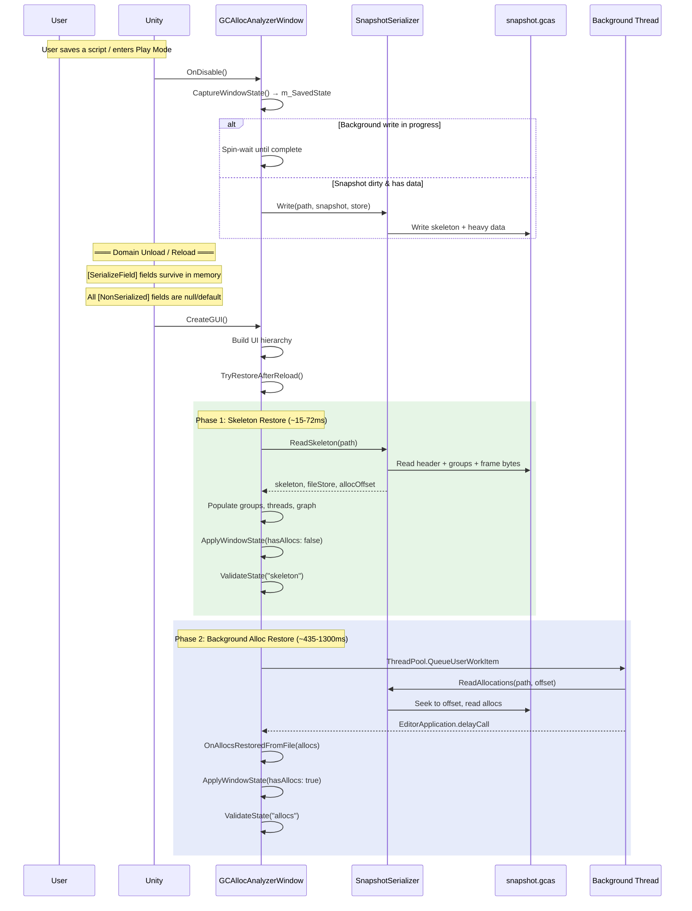
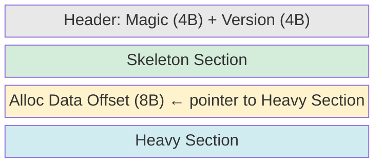
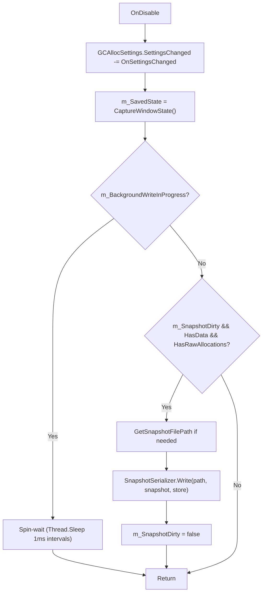
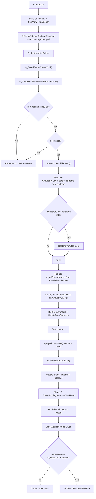
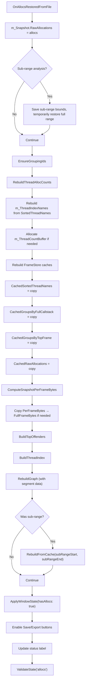
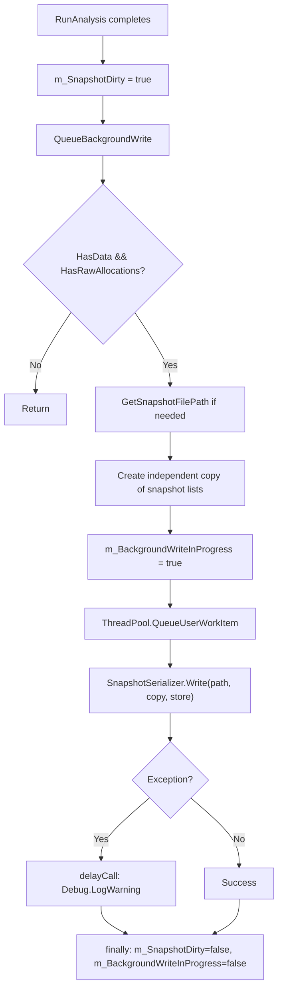
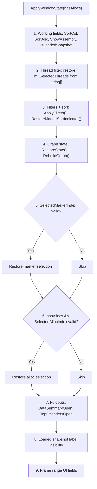
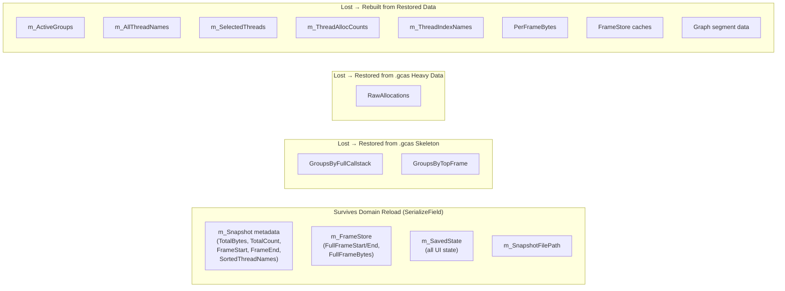

# Domain Reloading System — Comprehensive Documentation

## Context

This document describes how GCAllocAnalyzer survives Unity's **domain reload** (triggered by script saves, entering/exiting Play Mode, etc.). Domain reload destroys all managed state except `[SerializeField]` fields on `EditorWindow` subclasses. The system uses a two-phase restore architecture: instant skeleton from a binary `.gcas` file, followed by background allocation loading.

---

## 1. High-Level Flow



---

## 2. Classes Involved

### 2.1 `GCAllocAnalyzerWindow` — [GCAllocAnalyzerWindow.cs](../Editor/GCAllocAnalyzerWindow.cs)

The main `EditorWindow`. Owns the entire domain reload lifecycle.

#### Serialized Fields (survive domain reload)

| Field | Type | Line | What It Stores |
|-------|------|------|----------------|
| `m_Snapshot` | `AnalysisSnapshot` | 133 | Core analysis metadata (TotalBytes, TotalCount, FrameStart, FrameEnd, HadCallStacks, SortedThreadNames). **Note:** Groups, RawAllocations, PerFrameBytes are `[NonSerialized]` — restored from file. |
| `m_FrameStore` | `GraphFrameStore` | 134 | Full-range frame data (FullFrameStart, FullFrameEnd, FullFrameBytes). Cached analysis lists are `[NonSerialized]`. |
| `m_SavedState` | `WindowState` | 135 | Complete UI state snapshot (filters, sort, selections, foldouts, graph viewport). |
| `m_SnapshotFilePath` | `string` | 136 | Path to `.gcas` binary file used for restore. |

#### Non-Serialized Fields (lost on reload, rebuilt)

| Field | Type | Line | How Rebuilt |
|-------|------|------|-------------|
| `m_ActiveGroups` | `List<CallsiteGroup>` | 145 | Set from `m_Snapshot.GroupsByFullCallstack` or `GroupsByTopFrame` based on `m_GroupByCallsite.value` (line 546-547) |
| `m_AllThreadNames` | `HashSet<string>` | 151 | Rebuilt from `m_Snapshot.SortedThreadNames` (lines 541-544) |
| `m_SelectedThreads` | `HashSet<string>` | 152 | Rebuilt in `ApplyWindowState()` from `m_SavedState.SelectedThreads` (lines 361-366) |
| `m_ThreadAllocCounts` | `Dictionary<string,int>` | 153 | Rebuilt via `RebuildThreadAllocCounts()` in Phase 2 (line 740) |
| `m_ThreadIndexNames` | `List<string>` | 154 | Rebuilt from `SortedThreadNames` in Phase 2 (lines 747-749) |
| `m_ThreadCountBuffer` | `int[]` | 155 | Allocated in Phase 2 if null/too small (lines 750-751) |
| `m_RestoreGeneration` | `int` | 256 | Generation counter to discard stale background results |
| `m_BackgroundWriteInProgress` | `volatile bool` | 258 | Tracks whether background write thread is active |
| `m_SnapshotDirty` | `bool` | 259 | Whether snapshot needs serialization to disk |

### 2.2 `AnalysisSnapshot` — [GCAllocAnalyzerData.cs:14-43](../Editor/GCAllocAnalyzerData.cs)

`[Serializable]` class holding core analysis data.

```
┌─────────────────────────────────────────────────┐
│ AnalysisSnapshot                                │
├─────────────────────────────────────────────────┤
│ Serialized (survive reload):                    │
│   SortedThreadNames: List<string>               │
│   TotalBytes: long                              │
│   TotalCount: int                               │
│   FrameStart: int                               │
│   FrameEnd: int                                 │
│   HadCallStacks: bool                           │
├─────────────────────────────────────────────────┤
│ [NonSerialized] (restored from .gcas file):     │
│   RawAllocations: List<RawAllocation>            │
│   GroupsByFullCallstack: List<CallsiteGroup>     │
│   GroupsByTopFrame: List<CallsiteGroup>          │
│   PerFrameBytes: long[]                          │
├─────────────────────────────────────────────────┤
│ Methods:                                        │
│   HasData => TotalCount > 0                     │
│   HasRawAllocations => RawAllocations?.Count > 0│
│   EnsureNonSerializedLists()                    │
└─────────────────────────────────────────────────┘
```

**Why groups are `[NonSerialized]`:** `CallsiteGroup` objects contain `List<ResolvedFrame>` call stacks, `TopWorst` arrays, and many pre-computed strings. Unity serializes by value (not reference), so serializing groups across two lists would duplicate every string and array. The binary `.gcas` file handles deduplication via string interning.

### 2.3 `GraphFrameStore` — [GCAllocAnalyzerData.cs:388-441](../Editor/GCAllocAnalyzerData.cs)

`[Serializable]` class holding full-range frame data and cached analysis for sub-range rebuilds.

```
┌─────────────────────────────────────────────────┐
│ GraphFrameStore                                 │
├─────────────────────────────────────────────────┤
│ Serialized:                                     │
│   FullFrameStart: int                           │
│   FullFrameEnd: int                             │
│   FullFrameBytes: long[]                        │
├─────────────────────────────────────────────────┤
│ [NonSerialized] (rebuilt in Phase 2):            │
│   CachedRawAllocations: List<RawAllocation>      │
│   CachedSortedThreadNames: List<string>          │
│   CachedGroupsByFullCallstack: List<CallsiteGroup>│
│   CachedGroupsByTopFrame: List<CallsiteGroup>    │
├─────────────────────────────────────────────────┤
│ Methods:                                        │
│   HasFullFrameData, HasCachedAnalysis            │
│   Clear(), CacheAnalysis(...)                    │
└─────────────────────────────────────────────────┘
```

**Why cached lists are `[NonSerialized]`:** `CachedRawAllocations` is a copy of the full 1.87M+ allocation list. Unity serializes by value, so serializing the same allocations in both `m_Snapshot.RawAllocations` and `m_FrameStore.CachedRawAllocations` would multiply serialization cost 4x.

### 2.4 `WindowState` — [GCAllocAnalyzerData.cs:448-503](../Editor/GCAllocAnalyzerData.cs)

`[Serializable]` struct capturing all user-visible state as a single unit.

| Field | Type | Description |
|-------|------|-------------|
| `Graph` | `BarGraphViewSnapshot` | Graph zoom, pan, sort mode, selection |
| `NameFilter` | `string` | Include filter text |
| `ExcludeFilter` | `string` | Exclude filter text |
| `GroupByCallsite` | `bool` | Group by full callstack vs top frame |
| `SelectedThreads` | `string[]` | Thread filter (empty = all) |
| `SortCol` | `int` | Active sort column (cast from enum) |
| `SortAsc` | `bool` | Sort direction |
| `SelectedMarkerIndex` | `int` | Selected row in marker list |
| `SelectedAllocIndex` | `int` | Selected row in alloc list |
| `ShowAssembly` | `bool` | Assembly name display toggle |
| `IsLoadedSnapshot` | `bool` | Whether viewing a loaded .gcas file |
| `DataSummaryOpen` | `bool` | Data summary foldout state |
| `TopOffendersOpen` | `bool` | Top offenders foldout state |

Has `EnsureValid()` to patch null reference-type fields after format changes (line 497-502).

### 2.5 `SnapshotSerializer` — [SnapshotSerializer.cs](../Editor/SnapshotSerializer.cs)

Static class handling binary serialization to `.gcas` files.

#### Constants (lines 11-16)

| Constant | Value | Purpose |
|----------|-------|---------|
| `k_GCAllocSnapshot` | `0x53414347` ("GCAS") | Magic number for file identification |
| `k_Version` | `3` | Format version |
| `k_StringsPerAlloc` | `11` | String fields per RawAllocation |
| `k_BytesPerAlloc` | `92` | 48 numeric + 44 string index bytes |
| `k_ChunkAllocs` | `8192` | Allocations per write chunk |
| `k_IOBuffer` | `4 MB` | File I/O buffer size |

#### Public Methods

| Method | Line | Thread | Purpose |
|--------|------|--------|---------|
| `Write(path, snapshot, store)` | 22 | Main or BG | Serialize skeleton + heavy data |
| `ReadSkeleton(path, out store, out offset)` | 196 | Main | Read groups + frame bytes only |
| `ReadAllocations(path, offset)` | 247 | Background | Read allocations from file offset |
| `Read(path, out store)` | 347 | Main | Full synchronous read (skeleton + allocs) |
| `VerifyRoundTrip(snapshot, store)` | 610 | Any | Verify serialize/deserialize integrity |

### 2.6 `PerFrameGraphController` — [PerFrameGraphController.cs](../Editor/PerFrameGraphController.cs)

Manages graph state capture/restore for domain reload.

| Method | Line | Purpose |
|--------|------|---------|
| `CaptureState()` | 841-844 | Returns `m_BarGraph.CreateViewSnapshot()` |
| `RestoreState(state)` | 846-852 | Restores viewport, zoom, pan, sort from `BarGraphViewSnapshot` |

No lifecycle methods — state is managed entirely by the parent window via `CaptureWindowState()` / `ApplyWindowState()`.

---

## 3. Binary File Format (`.gcas` v3)



### Skeleton Section (read by `ReadSkeleton`)
1. **Metadata:** TotalBytes (i64), TotalCount (i32), FrameStart (i32), FrameEnd (i32), HadCallStacks (bool)
2. **SortedThreadNames:** count (i32) + N strings
3. **GraphFrameStore:** FullFrameStart (i32), FullFrameEnd (i32), FullFrameBytes (bulk byte copy via `Buffer.BlockCopy`)
4. **GroupsByFullCallstack:** serialized group list (statistics, display strings, per-frame stats, call stacks)
5. **GroupsByTopFrame:** serialized group list
6. **Alloc data offset:** i64 position pointing to start of heavy section

### Heavy Section (read by `ReadAllocations`)
1. **String table:** count (i32) + N strings (deduplicated via Dictionary during write)
2. **Callstack table:** count (i32) + indexed `ResolvedFrame[]` entries (by FullCallstackId)
3. **Allocations:** chunked in 8192-alloc blocks, 92 bytes each (48 numeric + 44 string indices)
4. **Checksum:** i64 sum of all allocation bytes

### File Access Modes
- **Write:** `FileShare.None` (exclusive)
- **Read:** `FileShare.Read` (multiple readers allowed — skeleton and alloc reads use separate handles)

---

## 4. Method Call Chains

### 4.1 Pre-Reload: OnDisable



**`CaptureWindowState()`** (lines 311-344):
1. Captures graph viewport via `m_GraphController.CaptureState()`
2. Reads all UI element values (filters, sort column, selections, foldouts, display toggles)
3. Serializes `m_SelectedThreads` HashSet → `string[]` (HashSet is not Unity-serializable)
4. Returns `WindowState` struct → stored in `[SerializeField] m_SavedState`

### 4.2 Post-Reload: CreateGUI → TryRestoreAfterReload



### 4.3 Phase 2 Completion: OnAllocsRestoredFromFile



### 4.4 Background Write (After Analysis)



**Why independent copies?** Sub-range drag-selects call `RebuildFromCache()` on the main thread, which clears and repopulates GroupsByFullCallstack/TopFrame and RawAllocations. Without copies, the background writer iterating these lists would hit concurrent modification.

### 4.5 ApplyWindowState



**Call order matters:** Each step depends on prior steps (e.g., filters must be applied before marker selection can be validated).

---

## 5. State Validation

`ValidateState(phase)` (lines 604-718) runs after both skeleton and allocs restore phases.

### Structural Invariants (both phases)
- `GroupsByFullCallstack` not empty
- `GroupsByTopFrame` not empty
- `m_ActiveGroups` not null
- `m_GraphController` not null
- `FullFrameBytes` length matches `FullFrameEnd - FullFrameStart + 1`

### User-Visible State Checks (both phases)
- `NameFilter`, `ExcludeFilter`, `GroupByCallsite` match `m_SavedState`
- `SortCol`, `SortAsc` match
- Thread filter count matches
- Marker selection index matches (if valid)
- Graph viewport (ZoomX, ZoomY, SortMode) matches within tolerance
- `ShowAssembly`, `DataSummaryOpen`, `TopOffendersOpen` match

### Alloc-Phase-Only Checks
- `RawAllocations.Count == TotalCount`
- `ThreadIndexNames.Count == SortedThreadNames.Count`
- `CachedRawAllocations` not empty
- `PerFrameBytes` not null
- Frame range bounds consistency
- Frame selection buffer consistency

---

## 6. What Survives vs What's Lost



---

## 7. File Location

```
{Application.temporaryCachePath}/GCAllocAnalyzer/snapshot.gcas
```

Generated by `GetSnapshotFilePath()` (lines 431-436). Directory is created on demand via `Directory.CreateDirectory()`.

---

## 8. Known Issue: Domain Reload Freeze

The domain reload itself (Unity's internal unload/reload process between `OnDisable` END and `CreateGUI`) freezes proportionally to allocation count. This is **not** caused by our serialization — it occurs entirely inside Unity's black box.

| Allocs | Freeze Duration |
|--------|----------------|
| 0 (no analysis) | ~few seconds |
| 233K (599 frames) | 16s |
| 1.87M (4000 frames) | 105-166s |

**Ruled out:** Clearing managed references, GC.Collect, ListView unbinding, SelectedFrameBuffer, closing Profiler window, all [SerializeField] fields (trivially small). The mechanism that scales with allocation count and persists after managed data is cleared remains unknown.

---

## 9. Timing Summary

| Phase | When | Duration | What User Sees |
|-------|------|----------|----------------|
| OnDisable write | Before reload | Background (or sync fallback) | Nothing (write is queued after analysis) |
| Domain reload | Unity internal | 2s-166s (proportional to allocs) | **Frozen editor** |
| Skeleton restore | After reload | 15-72ms | Marker list + graph appear |
| Alloc restore | Background thread | 435-1300ms | Status bar shows "loading N allocs..." |
| Full interactivity | After alloc restore | - | Save/Export enabled, alloc selection restored |
