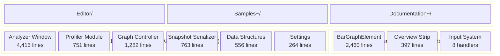
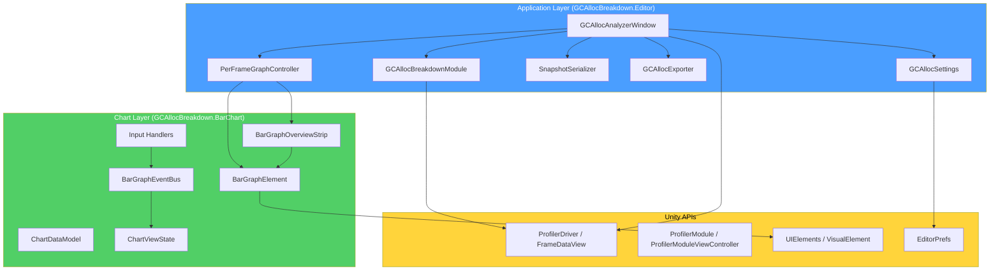
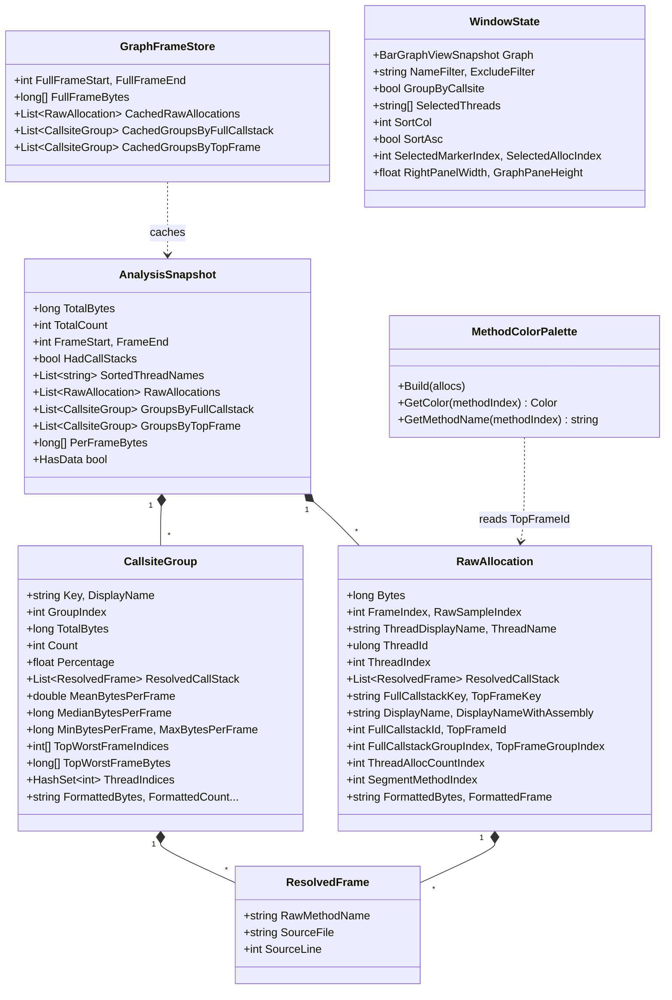
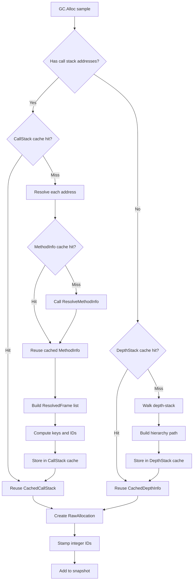
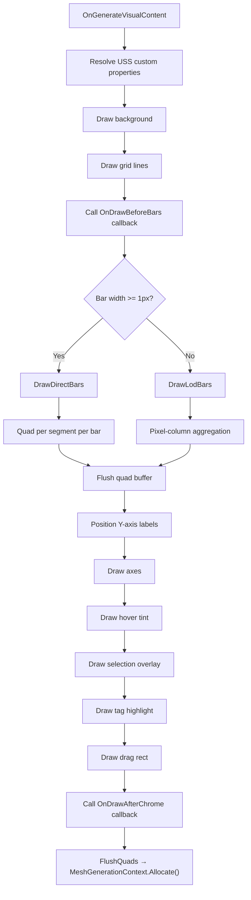
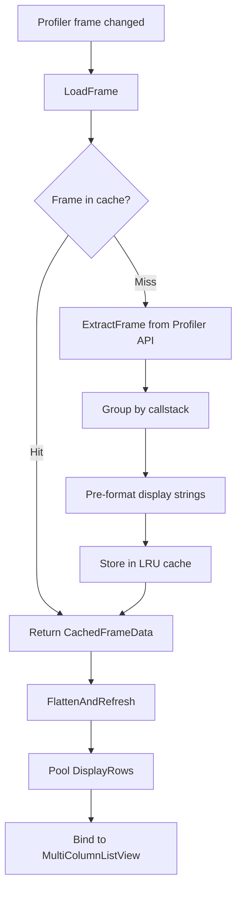

# GC Alloc Analyzer — Package Architecture

> **Package**: `com.ericjrico.gcalloc-analyzer@0.1.0`
> **Unity Requirement**: 6000.0+
> **License**: MIT
> **Author**: Eric J Rico
> **Namespace**: `GCAllocBreakdown.Editor` (main), `GCAllocBreakdown.BarChart` (graph subsystem)

---

## Table of Contents

1. [Package Overview](#1-package-overview)
2. [High-Level Architecture](#2-high-level-architecture)
3. [Data Model](#3-data-model)
4. [Analysis Pipeline](#4-analysis-pipeline)
5. [Main Window UI Architecture](#5-main-window-ui-architecture)
6. [Per-Frame Graph System](#6-per-frame-graph-system)
7. [BarChart Rendering Engine](#7-barchart-rendering-engine)
8. [Input System](#8-input-system)
9. [Profiler Module](#9-profiler-module)
10. [Domain Reload & Persistence](#10-domain-reload--persistence)
11. [Binary Serialization Format](#11-binary-serialization-format)
12. [Performance Optimizations](#12-performance-optimizations)
13. [Settings & Theming](#13-settings--theming)
14. [Supporting Utilities](#14-supporting-utilities)
15. [Test Infrastructure](#15-test-infrastructure)
16. [Compare Mode (feature branch)](#16-compare-mode-feature-branch)
17. [Key File Reference](#17-key-file-reference)

---

## 1. Package Overview

### Identity

| Field | Value |
|-------|-------|
| Package Name | `com.ericjrico.gcalloc-analyzer` |
| Version | `0.1.0` |
| Display Name | GC Alloc Analyzer |
| Unity | 6000.0+ |
| License | MIT |
| Author | Eric J Rico |

### Assembly Definitions

| Assembly | Scope | References | Purpose |
|----------|-------|------------|---------|
| `GCAllocBreakdown.Editor` | Editor | `GCAllocBreakdown.BarChart` | Main editor tools — analyzer window, profiler module, serialization, export |
| `GCAllocBreakdown.BarChart` | Editor | *(none)* | Self-contained bar graph rendering engine — zero profiler knowledge |

`GCAllocBreakdown.BarChart` has **no references** — it is fully self-contained and reusable in any UIToolkit context without pulling in profiler dependencies.

### Directory Structure

```
com.ericjrico.gcalloc-analyzer/
├── package.json
├── Editor/
│   ├── GCAllocAnalyzerWindow.cs      (4,415 lines) — Main EditorWindow
│   ├── GCAllocAnalyzerData.cs          (556 lines) — Data structures
│   ├── GCAllocBreakdownModule.cs       (751 lines) — Profiler module
│   ├── PerFrameGraphController.cs    (1,282 lines) — Graph controller
│   ├── SnapshotSerializer.cs           (763 lines) — Binary .gcas format
│   ├── GCAllocSettings.cs              (264 lines) — EditorPrefs settings
│   ├── GCAllocExporter.cs              (127 lines) — CSV export
│   ├── ScriptOpener.cs                 (245 lines) — IDE script navigation
│   ├── ProfilerSelectionHandler.cs     (135 lines) — Click/drag selection
│   ├── ProfilerKeyboardHandler.cs      (106 lines) — Keyboard selection
│   ├── GCAllocBreakdown.Editor.asmdef
│   ├── Resources/
│   │   └── GCAllocAnalyzer.uss                     — Application USS overrides
│   └── BarChart/                                    — Self-contained graph subsystem
│       ├── GCAllocBreakdown.BarChart.asmdef
│       ├── Resources/
│       │   ├── BarGraph.uss                         — Base graph theme
│       │   └── BarGraphOverviewStrip.uss            — Overview strip theme
│       ├── Core/
│       │   ├── BarGraphElement.cs        (2,460 lines) — Rendering engine
│       │   ├── BarGraphElement.DrawCallbacks.cs (110) — Draw hooks
│       │   ├── BarGraphElement.Visuals.cs    (467)    — Label pool, USS resolution
│       │   ├── BarGraphOverviewStrip.cs      (397)    — Miniature viewport
│       │   ├── ChartDataModel.cs             (205)    — Data storage + change notifications
│       │   ├── ChartViewState.cs             (136)    — Zoom/pan/selection state
│       │   ├── BarGraphViewSnapshot.cs        (47)    — Serializable view capture
│       │   ├── BarGraphSettings.cs            (43)    — Input flags, text formatters
│       │   ├── BarGraphDrawContext.cs          (81)    — Context for draw callbacks
│       │   ├── BarEntry.cs                    (49)    — Single bar struct
│       │   └── BarSegment.cs                  (45)    — Single segment struct
│       ├── Events/
│       │   └── BarGraphEvents.cs              (98)    — Event arg structs
│       └── Input/
│           ├── BarGraphEventBus.cs            (44)    — Signal relay
│           ├── BarGraphUIToolkitInput.cs     (215)    — Manipulator → EventBus
│           ├── IBarGraphHandler.cs            (28)    — Handler interface
│           ├── IBarGraphInputSource.cs        (19)    — Input source interface
│           └── Handlers/
│               ├── BarGraphScrollbarHandler.cs (318) — Horizontal scrollbar
│               ├── BarGraphSelectionHandler.cs (134) — Click/drag selection
│               ├── BarGraphKeyboardSelectionHandler.cs (117) — Enter/Space select
│               ├── BarGraphKeyboardNavigationHandler.cs (104) — Arrow keys
│               ├── BarGraphYAxisDragHandler.cs (103)  — Vertical scale drag
│               ├── BarGraphZoomHandler.cs       (63)  — Mouse wheel zoom
│               ├── BarGraphPanHandler.cs         (52) — Middle-mouse pan
│               └── BarGraphHoverHandler.cs       (32) — Hover tracking
├── Samples~/GCAllocTests/                              — Test allocation generators
│   ├── GCAllocTestRig.cs              (101 lines) — Test rig orchestrator
│   ├── CommonAllocPatterns.cs         (377 lines)
│   ├── ParamsAndBoxingEdgeCases.cs    (404 lines)
│   ├── ThreadedAllocator.cs           (320 lines)
│   ├── UnityAPIAllocPatterns.cs       (314 lines)
│   ├── LINQAllocPatterns.cs           (306 lines)
│   ├── VariedSizeAllocator.cs         (260 lines)
│   ├── DeepCallstackAllocator.cs      (255 lines)
│   ├── EventAllocGenerator.cs         (236 lines)
│   ├── CoroutineAllocGenerator.cs     (213 lines)
│   ├── InitAndPeriodicAllocs.cs       (165 lines)
│   └── TestProfile.cs                  (12 lines)
└── Documentation~/
    ├── plans/                           — Implementation plans
    ├── reviews/                         — Code review notes
    └── images/                          — README screenshots
```

### Package Structure



---

## 2. High-Level Architecture

The package follows a two-layer architecture with a strict dependency boundary. The **Application Layer** (`GCAllocBreakdown.Editor`) owns all profiler knowledge — extraction, grouping, serialization, UI orchestration. The **Chart Layer** (`GCAllocBreakdown.BarChart`) is a pure rendering and interaction engine that knows nothing about profilers, allocations, or call stacks. It accepts generic bar/segment data and produces an interactive chart.

The dependency is one-way: the Editor assembly references the BarChart assembly, never the reverse. This means the BarChart subsystem can be extracted into a standalone package with zero changes.

### Layer Dependency Diagram



### Core Architectural Patterns

| Pattern | Implementation | Purpose |
|---------|---------------|---------|
| **Zero-Alloc Binding** | Pre-computed display strings, userData callbacks | UI cell bind methods cause zero GC allocations |
| **Integer-Keyed Grouping** | `FullCallstackId`, `TopFrameId` arrays | O(1) array indexing replaces string dictionary lookups during grouping |
| **Multi-Level Caching** | CallStack, MethodInfo, ThreadInfo, DepthStack caches | Avoid redundant Profiler API calls across 1.87M allocations |
| **Pre-Computed Strings** | `FormattedBytes`, `FormattedFrame`, etc. | Format once during extraction, reuse in every UI bind |
| **Buffer Reuse** | `m_GroupFrameBuffer`, `m_PerFrameBuffer`, `m_SharedSB` | Reusable arrays and StringBuilder — no per-frame allocations |
| **Object Pooling** | `DisplayRow` pool in profiler module | Avoids allocation churn when flattening group-to-row hierarchy |
| **LRU Caching** | 512-frame cache in profiler module | Instant frame switching when scrubbing the Profiler timeline |
| **Skeleton/Heavy Split** | `SnapshotSerializer.ReadSkeleton()` / `ReadAllocations()` | Instant UI restore (< 100ms) with background alloc loading |
| **Two-Phase Domain Reload** | Skeleton restore then background alloc restore | Window appears immediately, full interactivity restored async |

---

## 3. Data Model

All data structures live in `Editor/GCAllocAnalyzerData.cs` (556 lines).

### Class Diagram



### AnalysisSnapshot (lines 14-43)

Central serializable container for a complete analysis.

**Serialized fields** (survive domain reload via Unity serialization):
- `TotalBytes: long`, `TotalCount: int` — aggregate totals
- `FrameStart, FrameEnd: int` — analyzed frame range (0-based API indices)
- `SortedThreadNames: List<string>` — alphabetically sorted thread display names
- `HadCallStacks: bool` — whether Profiler had "Call Stacks -> GC.Alloc" enabled

**NonSerialized fields** (rebuilt from .gcas file after domain reload):
- `RawAllocations: List<RawAllocation>` — every individual GC.Alloc event (capacity 4096)
- `GroupsByFullCallstack, GroupsByTopFrame: List<CallsiteGroup>` — grouped results (capacity 256)
- `PerFrameBytes: long[]` — per-frame GC totals

**Key semantics**: `HasData` returns `true` when skeleton metadata exists (TotalCount > 0), even if RawAllocations are still loading on a background thread.

### RawAllocation (lines 50-93)

Individual allocation event. All fields are pre-computed during extraction and never mutated afterward.

**Profiler data:**
- `Bytes, FrameIndex, RawSampleIndex` — allocation size and location
- `ThreadDisplayName, ThreadName, ThreadGroupName, ThreadId, ThreadIndex` — thread identity

**Call stack:**
- `ResolvedCallStack: List<ResolvedFrame>` — full resolved call stack
- `ParentMethod, HierarchyPath` — fallback for no-callstack allocations (depth-stack resolution)

**Pre-computed grouping keys:**
- `FullCallstackKey, TopFrameKey` — string keys (built once, used for cache lookup)
- `FullCallstackId, TopFrameId: int` — unique integer IDs replacing string keys for O(1) array-indexed grouping
- `FullCallstackGroupIndex, TopFrameGroupIndex: int` — stable group indices stamped during BuildGrouping (enables fast sub-range regrouping)
- `ThreadAllocCountIndex: int` — dense thread index for int[] counting
- `SegmentMethodIndex: int` — palette index for stacked bar segments (NonSerialized, rebuilt by `MethodColorPalette.Build`)

**Pre-computed display:**
- `DisplayName, DisplayNameWithAssembly` — formatted top frame
- `FormattedBytes, FormattedFrame` — human-readable size and frame number

### CallsiteGroup (lines 96-145)

One entry per unique call stack (or top frame) after grouping.

**Identity:** `Key`, `DisplayName`, `DisplayNameNoAssembly`, `DisplayNameWithAssembly`, `HierarchyPath`, `GroupIndex`

**Aggregates:** `TotalBytes`, `Count`, `Percentage`

**Per-frame statistics:**
- `MeanBytesPerFrame`, `MedianBytesPerFrame`, `MinBytesPerFrame`, `MaxBytesPerFrame`
- `MinFrame`, `MaxFrame`, `FirstFrame`
- `TopWorstFrameIndices[3]`, `TopWorstFrameBytes[3]` — top 3 worst frames by bytes

**First allocation info** (for CPU module sync):
- `FirstAllocFrameIndex`, `FirstAllocRawSampleIndex`, `FirstAllocThreadName`, `FirstAllocThreadGroupName`, `FirstAllocThreadId`

**Thread tracking:** `ThreadIndices: HashSet<int>` (NonSerialized) — dense thread indices that contributed allocations, enabling O(1) thread filter checks.

**Pre-computed display strings:** `FormattedBytes`, `FormattedCount`, `FormattedAvg`, `FormattedPct`, `FormattedMedian`, `FormattedMin`, `FormattedMax`, `FormattedMean`, `FormattedRange`, `FormattedFirst`, `FormattedTopWorst[]`

### ResolvedFrame (lines 147-153)

Single frame in a call stack: `RawMethodName` (e.g. `"mscorlib!System.String.Concat"`), `SourceFile`, `SourceLine`.

### DepthEntry (lines 155-160)

Internal helper for navigating the Profiler's sample tree when no call stacks are available: `Name`, `MarkerId`, `Remaining`.

### GraphFrameStore (lines 426-479)

Cache for the full profiler range, enabling fast sub-range analysis without re-extracting from the Profiler.

**Serialized:** `FullFrameStart, FullFrameEnd: int`, `FullFrameBytes: long[]`

**NonSerialized (rebuilt):** `CachedRawAllocations`, `CachedSortedThreadNames`, `CachedGroupsByFullCallstack`, `CachedGroupsByTopFrame`

Design note: NonSerialized lists are NOT duplicated to avoid 4x serialization cost. Unity serializes by value, not reference, so duplicated lists would multiply serialization cost proportionally.

### WindowState (lines 486-555)

Serializable struct capturing all user-visible state for domain reload persistence: graph viewport (`BarGraphViewSnapshot`), filters (`NameFilter`, `ExcludeFilter`, `GroupByCallsite`, `SelectedThreads`), sort order (`SortCol`, `SortAsc`), selections (`SelectedMarkerIndex`, `SelectedAllocIndex`), foldout states (`DataSummaryOpen`, `TopOffendersOpen`, `TopOffendersCount`), display flags (`ShowAssembly`, `IsLoadedSnapshot`), and layout dimensions (`RightPanelWidth`, `GraphPaneHeight`). `EnsureValid()` patches null fields after deserialization format changes.

### MethodColorPalette (lines 281-418)

Assigns colors to allocation sites in the stacked bar graph.

**Algorithm:**
1. Sum bytes per `TopFrameId` using integer array indexing (no string hashing)
2. Sort by bytes descending
3. Assign palette index in rank order (16-color static palette, "Others" grey for rank > 16)
4. Stamp `SegmentMethodIndex` on each allocation for O(1) bar segment rendering

### GCAllocUtils (lines 166-275)

Static utility methods:
- `DisplayFrame` / `ApiFrame` — 0-based to 1-based conversion and back
- `FormatBytes` — human-readable B/KB/MB formatting
- `ExtractAssembly` / `StripAssembly` / `StripLeadingColons` — method name parsing
- `FormatTopFrame` / `FormatTopFrameWithAssembly` — display-ready method names with source info
- `NormalizeKeyPart` / `AppendNormalizedKeyPart` — grouping key normalization
- `EscapeCsvField` — CSV-safe field escaping

---

## 4. Analysis Pipeline

The analysis pipeline in `GCAllocAnalyzerWindow.cs` transforms raw Profiler data into grouped, sorted, display-ready results through five phases.

### Pipeline Sequence

```mermaid
sequenceDiagram
    participant User
    participant Window as GCAllocAnalyzerWindow
    participant Profiler as Unity Profiler API
    participant Cache as Multi-Level Caches
    participant Groups as BuildGrouping
    participant Stats as ComputeAllPerFrameStats
    participant UI as Marker List + Graph

    User->>Window: Click "Analyze"
    Window->>Window: RunAnalysis(startFrame, endFrame)

    rect rgb(40, 60, 80)
        Note over Window,Profiler: Phase 1 — Thread Pre-Scan
        Window->>Profiler: GetRawFrameDataView(frame 0)
        Profiler-->>Window: Thread indices with GC.Alloc markers
    end

    rect rgb(60, 40, 80)
        Note over Window,Cache: Phase 2 — Frame Extraction
        loop For each frame in [start..end]
            loop For each thread with GC.Alloc
                Window->>Profiler: GetRawFrameDataView(frame, thread)
                loop For each GC.Alloc sample
                    Window->>Cache: Check CallStack cache (addr hash)
                    alt Cache hit (99%+ of allocations)
                        Cache-->>Window: Reuse CachedCallStack
                    else Cache miss
                        Window->>Profiler: ResolveMethodInfo(addr)
                        Window->>Cache: Store new CachedCallStack
                    end
                    Window->>Window: Create RawAllocation (pre-computed)
                end
            end
        end
    end

    rect rgb(40, 80, 60)
        Note over Window,Groups: Phase 3 — Grouping
        Window->>Groups: BuildGrouping(byFullCallstack)
        Note over Groups: Array-indexed by FullCallstackId/TopFrameId
        Groups-->>Window: List~CallsiteGroup~
    end

    rect rgb(80, 60, 40)
        Note over Window,Stats: Phase 4 — Per-Frame Statistics
        Window->>Stats: ComputeAllPerFrameStats()
        Note over Stats: Single-pass flat buffer computation
        Stats-->>Window: min/max/median/mean per group
    end

    rect rgb(60, 80, 40)
        Note over Window,UI: Phase 5 — Filter, Sort, Display
        Window->>Window: ApplyFilters()
        Window->>Window: SortInPlace()
        Window->>UI: Refresh marker list + graph
    end
```



### Phase 1: Thread Pre-Scan

Iterates threads 0-255 on the first frame using `GetRawFrameDataView()`, records which threads have `GC.Alloc` markers and the maximum thread index for array sizing.

### Phase 2: Frame Extraction

The main extraction loop processes each frame/thread/sample, using a four-level caching hierarchy to minimize redundant Profiler API calls:

| Level | Cache | Key | Hit Rate | Saves |
|-------|-------|-----|----------|-------|
| 1 | **CallStack cache** | Hash of address sequence | ~99%+ | All method resolution, key computation, ID assignment |
| 2 | **MethodInfo cache** | Address (`ulong`) | High | Redundant `ResolveMethodInfo()` calls |
| 3 | **ThreadInfo cache** | Thread index (`int`) | 100% per thread | Redundant thread metadata lookups |
| 4 | **DepthStack cache** | Hash of depth-stack marker IDs | ~99%+ | No-callstack allocations (depth-stack fallback) |



With ~396 unique call stacks across 1.87M allocations, cache hits skip ALL method resolution for 99%+ of allocations.

### Phase 3: Integer-Keyed Grouping

`BuildGrouping()` performs single-pass grouping using integer array indexing:
1. Allocate `m_GroupingArray[maxId]` (indexed by `FullCallstackId` or `TopFrameId`)
2. Loop over all RawAllocations — O(1) array lookup per allocation (no string hashing)
3. Create or accumulate into `CallsiteGroup`, stamp group index on each allocation
4. Populate `ThreadIndices` for per-group thread tracking

### Phase 4: Single-Pass Per-Frame Statistics

`ComputeAllPerFrameStats()` computes all groups' per-frame stats in a single pass:
1. Allocate flat buffer: `m_GroupFrameBuffer[groupCount * frameCount]`
2. Loop over all allocations once, accumulate bytes per group per frame
3. For each group, compute from its buffer slice: min, max, median (sort non-zero), mean (includes zero frames), top 3 worst frames

### Phase 5: Filtering & Sorting

`ApplyFilters()` filters groups by name/exclude predicates and thread selection, sorts by current column (`SortCol` enum: Bytes, Count, Avg, Pct, Name, Median, Mean, Min, Max, Range, First), then refreshes the marker list and graph.

### Performance Benchmarks (4,000 frames, 1.87M allocations)

| Phase | Time |
|-------|------|
| Thread Pre-Scan | ~10 ms |
| Frame Extraction | ~9,400 ms |
| BuildGrouping | ~178 ms |
| Per-Frame Stats | ~30 ms |
| Total | ~9,610 ms |

---

## 5. Main Window UI Architecture

`GCAllocAnalyzerWindow` (`Editor/GCAllocAnalyzerWindow.cs`, 4,415 lines) is the central EditorWindow.

### Section Map

The file uses `// ═══` comment blocks to delineate major sections:

| Section | Description |
|---------|-------------|
| CONSTANTS | Column widths, row heights, thread names, colors, column header factories |
| UI FIELDS | UIElements references (toolbar, panels, lists, foldouts) |
| SORT | `SortCol` enum (Bytes, Count, Avg, Pct, Name, Median, Mean, Min, Max, Range, First) |
| DATA FIELDS | Serialized fields, caches, buffers, timing instrumentation |
| PROFILER | Profiler frame selection sync |
| WINDOW LIFECYCLE | `ShowWindow`, `CreateGUI`, `OnDisable`, `TryRestoreAfterReload` |
| STATE VALIDATION | `ValidateState` comprehensive assertion |
| TOOLBAR | Frame range fields, Pull Data, Analyze, Save/Load/Export buttons |
| LEFT PANEL | Graph + marker list split layout |
| PER-FRAME BAR GRAPH | Graph controller integration |
| THREAD FILTER | Thread selection dropdown |
| CSV EXPORT | Export actions |
| RIGHT PANEL | Data summary, top offenders, marker details |
| TOOLBAR ACTIONS | Pull Data, Analyze, Save, Load handlers |
| DATA EXTRACTION | `RunAnalysis` — the extraction pipeline |
| GROUPING | `BuildGrouping`, group creation |
| PER-FRAME STATISTICS | `ComputeAllPerFrameStats`, `ComputePerFrameStatsFromBuffer` |
| FILTERING & SORTING | `ApplyFilters`, `SortInPlace`, thread filter logic |
| MARKER LIST | MultiColumnListView setup, cell binding |
| RIGHT PANEL UPDATES | `UpdateDataSummary`, `PopulateTopOffendersUI`, `UpdateMarkerSummary` |
| TOP OFFENDERS | Top N by total bytes, by avg/frame, single allocs |
| ALLOC LIST | MultiColumnListView for individual allocations |
| CPU MODULE SELECTION | Lazy reference to CPU module for frame sync |
| SCRIPT OPENING | Delegated to ScriptOpener |
| FORMATTING | Shared StringBuilder instance |
| CALLSTACK KEY | Shared StringBuilder for key building |
| UI DESIGN HELPERS | Common UI construction utilities |

### Core Serialized Fields (domain reload persistence)

```csharp
[SerializeField] AnalysisSnapshot m_Snapshot = new();
[SerializeField] GraphFrameStore m_FrameStore = new();
[SerializeField] WindowState m_SavedState = WindowState.Default;
[SerializeField] string m_SnapshotFilePath;
```

### UI Layout

- **Toolbar**: Start/End frame fields, Pull Data button, Analyze button, Save/Load/Export buttons, status label
- **Left Panel** (`TwoPaneSplitView`):
  - **Top**: Per-frame bar graph (`PerFrameGraphController`)
  - **Bottom**: Filters foldout (name, exclude, group-by-callsite toggle, thread filter) + Marker list (`MultiColumnListView`)
- **Right Panel** (`TwoPaneSplitView`):
  - Data Summary foldout (frame count, range, total GC bytes, total allocs, unique sites)
  - Top Offenders foldout (top N by total bytes, top N by avg/frame, top N single allocations)
  - Marker Summary (name, source location, stats table, call stack)
  - Individual Allocations list (`MultiColumnListView`)

### Marker List Columns (11)

Site (stretchable), Bytes, Count, Avg, %, Median, Mean, Min, Max, Range, First — all fixed-width, sortable.

### Sub-Range Analysis

When the user drag-selects frames on the graph:
1. `PerFrameGraphController` fires `OnDragCompleted`
2. Window calls `GetSelectedFrameBuffer()` which returns a `bool[]` of selected frames
3. `RebuildFromCache()` regroups using pre-stamped `FullCallstackGroupIndex`/`TopFrameGroupIndex` — no integer ID re-assignment needed
4. Recomputes per-frame stats for the sub-range only
5. Rebuilds graph with filtered data

---

## 6. Per-Frame Graph System

`PerFrameGraphController` (`Editor/PerFrameGraphController.cs`, 1,282 lines) orchestrates the per-frame bar graph. It is the bridge between the application-layer profiler concepts and the generic BarChart rendering engine.

### Key Members

| Member | Type | Purpose |
|--------|------|---------|
| `m_BarGraph` | `BarGraphElement` | Core rendering widget |
| `m_OverviewStrip` | `BarGraphOverviewStrip` | Miniature full-range viewport indicator |
| `m_MethodPalette` | `MethodColorPalette` | Method-to-color assignment |
| `m_BarEntries[]` | `BarEntry[]` | One per frame — total value + segment range |
| `m_BarSegments[]` | `BarSegment[]` | Multiple per bar — per-method value + color |
| `m_SegmentFlatArray` | `long[]` | `[frameRelIdx * methodCount + methodIdx]` = bytes |
| `m_SelectionBuffer[]` | `bool[]` | Per-frame selection state (survives data rebuild) |
| `m_OverlayValues[]` | `float[]` | Per-bar overlay intensity for method highlight |

### Data Flow

1. **`SetData(frameStore, snapshot, filteredGroups, groupByCallsite)`** — Store references, build palette via `MethodColorPalette.Build()`, build segments via `BuildSegmentData()`
2. **`BuildBarEntries()`** — Create `BarEntry[]` from `FullFrameBytes`, with per-method segments from `m_SegmentFlatArray`
3. **`BuildSegmentData()`** — Flatten per-method allocation bytes into the flat array; compute sort indices if `OrderByMagnitude` is active
4. Push data to `BarGraphElement` via `ChartDataModel`

### Method Overlay

`UpdateOverlay(group)` computes per-frame bytes for a single `CallsiteGroup`, normalizes to `[0..1]`, and passes as `m_OverlayValues[]` to highlight that method's contribution across all frames. A matching segment-level tag highlight is also activated when zoomed in enough to see individual segments.

### Drag-Select to Sub-Range Analysis

1. User drag-selects bars in the graph, which is handled by `ProfilerSelectionHandler` firing `DragCompleted`
2. Controller saves selection to `m_SelectionBuffer[]`
3. Window calls `GetSelectedFrameBuffer(out buffer, out baseFrame)` which returns a `bool[]`
4. Window re-analyzes the subset via `RebuildFromCache()`

### Overview Strip

`BarGraphOverviewStrip` contains an embedded `BarGraphElement` (no labels, no input handlers) with a draggable viewport indicator. Dragging the indicator pans the main chart; resizing its edges zooms. The strip is bound to the main graph via `BindTo()`.

### State Capture/Restore

`CaptureState()` / `RestoreState()` serialize the graph's zoom, pan, Y-axis max, sort mode, and frame selection into a `BarGraphViewSnapshot` struct for domain reload persistence. The selection buffer is captured separately from `m_SelectionBuffer[]` since `ChartViewState.SelectedBars` may have been cleared by `SetData()`.

### Input Handler Registration

Handlers are registered in order on the `BarGraphElement`:

| Order | Handler | Role |
|-------|---------|------|
| 1 | `BarGraphUIToolkitInput` | Mouse/keyboard events into EventBus |
| 2 | `BarGraphHoverHandler` | Hover tracking |
| 3 | `ProfilerSelectionHandler` | Click-to-bar/segment, drag-to-range |
| 4 | `BarGraphPanHandler` | Middle-mouse pan |
| 5 | `BarGraphZoomHandler` | Mouse wheel zoom |
| 6 | `BarGraphKeyboardNavigationHandler` | Arrow key navigation |
| 7 | `ProfilerKeyboardHandler` | Enter/Space to select |
| 8 | `BarGraphYAxisDragHandler` | Vertical scale drag |
| 9 | `BarGraphScrollbarHandler` | Horizontal scrollbar |

---

## 7. BarChart Rendering Engine

`Editor/BarChart/` is a self-contained, reusable stacked bar graph subsystem with zero profiler knowledge. It can be dropped into any Unity Editor tool that needs a high-performance bar chart.

### BarGraphElement (`Core/BarGraphElement.cs`, 2,460 lines + 2 partial files)

High-performance stacked vertical bar graph using direct quad rendering via `MeshGenerationContext`. Chrome elements (grid lines, axes, highlights, drag rectangles) use `Painter2D` since their vertex counts are trivially bounded. Bar geometry bypasses `Painter2D` entirely to avoid tessellation overhead and the 65,535-vertex ceiling.

### Rendering Pipeline (`OnGenerateVisualContent`)



The actual code flow is:

1. **Background** — `FillRect` with `_vis.BackgroundColor`
2. **Plot-area bounds** — compute `plotX, plotY, plotW, plotH` from USS padding
3. **Grid lines** — horizontal grid lines drawn below bars
4. **OnDrawBeforeBars** — user draw hook
5. **Primary bars** — `DrawDirectBars` or `DrawLodBars` depending on slot width
6. **Overlay bars** — same position mapping with tinted alpha (suppressed when tag highlight is active in direct mode, as segment-level tint provides the same information)
7. **FlushQuads** — all accumulated bar quads flushed to GPU via `MeshGenerationContext.Allocate()`
8. **OnDrawAfterBars** — user draw hook
9. **DrawHighlights** — selection fill, selection rim, hover tint, segment selection, tag highlight, focused bar indicator
10. **Drag rectangle** — if drag-selecting
11. **Padding overdraw** — re-fill four padding strips with background color to create a clean frame
12. **Axes** — drawn on top of bars and overdraw
13. **OnDrawAfterChrome** — user draw hook
14. **Label layout** — cache parameters for deferred `FlushLabelPositions` scheduler (cannot modify VisualElement styles during `generateVisualContent`)

### Direct Rendering (`DrawDirectBars`)

When bar slot width >= 1 screen pixel:
- Renders each segment as a colored quad
- One quad per segment per bar (within viewport)
- Segment-level LOD: sub-pixel segments are merged in a single O(n) pass, capping output to ~plotHeight rects per bar regardless of segment count
- Mapping: `screenY = plotY2 - (value / effectiveMaxY) * plotH * zoomY + panY * plotH`
- Quads written to `_quadBuf[]`, flushed via `FlushQuads()` in chunks of <= 16,383 quads (respects 65,535-vertex ceiling per `Allocate()` call, 4 vertices per quad)

### LOD Rendering (`DrawLodBars`)

When bar slot width < 1 screen pixel (zoomed out or many bars):
- Collapses all bars mapping to a pixel column into a single representative bar
- Uses max-value aggregation across the column
- O(pixelWidth) instead of O(barCount)
- Segments are lost in LOD mode — shows aggregate value only
- Color determined by largest-value segment (matches `DrawDirectBars` behavior)

### USS Custom Properties

| Property | Type | Default | Purpose |
|----------|------|---------|---------|
| `--bar-graph-bg-color` | Color | `rgb(18, 18, 26)` | Background fill |
| `--bar-graph-default-bar-color` | Color | `rgb(64, 153, 255)` | Default bar color |
| `--bar-graph-axis-color` | Color | `rgb(140, 140, 153)` | Axis lines |
| `--bar-graph-grid-line-color` | Color | `rgb(46, 46, 61)` | Grid lines |
| `--bar-graph-hover-tint-color` | Color | `rgba(255, 255, 255, 0.18)` | Hover highlight |
| `--bar-graph-selection-fill-color` | Color | `rgba(255, 255, 255, 0.22)` | Selection background |
| `--bar-graph-selection-rim-color` | Color | `rgba(102, 179, 255, 0.9)` | Selection border |
| `--bar-graph-segment-selection-color` | Color | *(not in base USS)* | Segment selection highlight |
| `--bar-graph-drag-rect-fill-color` | Color | `rgba(89, 166, 255, 0.08)` | Drag rectangle fill |
| `--bar-graph-drag-rect-border-color` | Color | `rgba(89, 166, 255, 0.6)` | Drag rectangle border |
| `--bar-graph-focus-rim-color` | Color | `rgb(255, 204, 51)` | Keyboard focus indicator |
| `--bar-graph-overlay-tint` | Color | `rgba(255, 255, 255, 0.38)` | Method overlay tint |
| `--bar-graph-tag-highlight-tint` | Color | `rgba(255, 255, 255, 0.22)` | Tag highlight glow |
| `--bar-graph-tag-highlight-outline` | Color | `rgba(0, 0, 0, 0)` | Tag outline |
| `--bar-graph-bar-spacing-ratio` | Float | `0.12` | Gap between bars (12% of slot width) |
| `--bar-graph-min-bar-width` | Float | `1` | Minimum bar width (px) |
| `--bar-graph-selection-rim-width` | Float | `1.5` | Selection border thickness |
| `--bar-graph-segment-selection-width` | Float | *(not in base USS)* | Segment selection border thickness |
| `--bar-graph-overlay-opacity` | Float | `0.35` | Overlay bar alpha |
| `--bar-graph-grid-line-width` | Float | `1` | Grid line thickness |
| `--bar-graph-axis-line-width` | Float | `1.5` | Axis line thickness |
| `--bar-graph-dim-opacity` | Float | `1` | Unselected bar alpha when selection active |
| `--bar-graph-tag-highlight-outline-width` | Float | `0` | Tag highlight outline thickness |
| `--bar-graph-padding-left` | Float | `52` | Y-axis label area width |
| `--bar-graph-padding-right` | Float | `12` | Right padding |
| `--bar-graph-padding-top` | Float | `12` | Top padding |
| `--bar-graph-padding-bottom` | Float | `32` | X-axis area height |
| `--bar-graph-label-height` | Float | `18` | Label element height |
| `--bar-graph-x-label-width` | Float | `40` | X-axis label width |
| `--bar-graph-x-label-offset-y` | Float | `3` | X-axis label vertical offset |
| `--bar-graph-y-label-gap` | Float | `4` | Gap between Y-axis labels |

### Draw Callbacks (`BarGraphElement.DrawCallbacks.cs`, 110 lines)

- `OnDrawBeforeBars`, `OnDrawAfterBars`, `OnDrawAfterChrome` — user draw hooks passing `BarGraphDrawContext`
- `BarVisualProvider: Func<int, BarVisualOverride?>` — per-visible-bar color/alpha override
- `TagHighlightFilter: Func<int, bool>` — per-bar filter for tag highlight rendering

### Label Pool (`BarGraphElement.Visuals.cs`, 467 lines)

Fixed-size pool of `Label` elements repositioned each repaint. Labels are added to a `.bar-graph__labels` overlay layer with `picking-mode: ignore` so pointer events pass through. Y-axis labels display data values (formatted via `Settings.YAxisLabelFormatter`); X-axis labels display bar indices or custom text. USS property resolution happens in `CustomStylesResolved` and populates the `ResolvedVisuals` struct, which is read by all draw methods.

### Supporting Data Structures

| Struct/Class | File | Lines | Purpose |
|-------------|------|-------|---------|
| `BarEntry` | `Core/BarEntry.cs` | 49 | Single bar: TotalValue, SegmentStart, SegmentCount, Color |
| `BarSegment` | `Core/BarSegment.cs` | 45 | Single segment: Value, Color, Tag (opaque int) |
| `ChartDataModel` | `Core/ChartDataModel.cs` | 205 | Holds `Bars[]` and `Segments[]`; fires change notifications |
| `ChartViewState` | `Core/ChartViewState.cs` | 136 | Zoom, pan, selection, hover — single source of truth for renderer |
| `BarGraphViewSnapshot` | `Core/BarGraphViewSnapshot.cs` | 47 | Serializable capture of view state |
| `BarGraphSettings` | `Core/BarGraphSettings.cs` | 43 | Input enable flags, Y-axis text formatter, tooltip formatter |
| `BarGraphDrawContext` | `Core/BarGraphDrawContext.cs` | 81 | Context passed to draw callbacks (Painter2D, MeshGenerationContext, plot area, view state) |

### BarGraphOverviewStrip (`Core/BarGraphOverviewStrip.cs`, 397 lines)

Miniature full-dataset chart with viewport indicator:
- Contains an embedded `BarGraphElement` (`.bar-graph--overview` class — no labels, minimal padding)
- Overlay indicator rectangle shows current viewport bounds
- Left/right resize handles for edge-dragging
- Subscribes to source chart's `ViewChanged` event to stay in sync
- USS: `BarGraphOverviewStrip.uss` overrides padding to 0, reduces bar spacing to 4%, hides labels

---

## 8. Input System

`Editor/BarChart/Input/` provides a composable input handling architecture. Input sources convert platform events to domain signals; handlers subscribe and update chart state.

### Architecture

```
UIToolkit events → BarGraphUIToolkitInput → BarGraphEventBus → Handler₁, Handler₂, ...
                   (Manipulator)            (signal relay)      (IBarGraphHandler impls)
```

- **`BarGraphEventBus`** (`Input/BarGraphEventBus.cs`, 44 lines) — Central signal relay. Input sources fire events; handlers subscribe. Events include `SelectPressed`, `SelectDragged`, `SelectReleased`, `SelectCancelled`, `PanDelta`, `ZoomDelta`, `HoverMoved`, `KeyPressed`, `KeyReleased`.
- **`BarGraphUIToolkitInput`** (`Input/BarGraphUIToolkitInput.cs`, 215 lines) — Implements `Manipulator` + `IBarGraphInputSource`. Converts UIToolkit mouse/keyboard events to EventBus signals.
- **`IBarGraphHandler`** (`Input/IBarGraphHandler.cs`, 28 lines) — Interface: `Register(BarGraphEventBus, BarGraphElement)` / `Unregister()`
- **`IBarGraphInputSource`** (`Input/IBarGraphInputSource.cs`, 19 lines) — Interface for input source lifecycle

### Handler Chain

All handlers live in `Input/Handlers/`:

| Handler | Lines | Role |
|---------|-------|------|
| `BarGraphHoverHandler` | 32 | Updates `HoveredBarIndex`, fires `HoverChanged` |
| `BarGraphSelectionHandler` | 134 | Click → bar/segment select; drag → range-select; fires `BarClicked`, `SegmentClicked`, `DragCompleted` |
| `BarGraphPanHandler` | 52 | Middle-mouse drag → update `PanX`/`PanY` |
| `BarGraphZoomHandler` | 63 | Mouse wheel → update `ZoomX`/`ZoomY` |
| `BarGraphKeyboardNavigationHandler` | 104 | Arrow keys → move `FocusedBarIndex` |
| `BarGraphKeyboardSelectionHandler` | 117 | Enter/Space → select focused bar; fires `BarClicked`, `SegmentClicked` |
| `BarGraphYAxisDragHandler` | 103 | Drag right edge of Y-axis label area → adjust vertical scale |
| `BarGraphScrollbarHandler` | 318 | Horizontal scrollbar at bottom → update `PanX` via thumb drag |

### Event Structs (`Events/BarGraphEvents.cs`, 98 lines)

Event argument structs for all EventBus signals. Lives in `Editor/BarChart/Events/` (separate from Input directory).

### Segment-Level Hit Testing

`BarGraphElement.HitTestSegment()` performs a walk through a bar's segments to find which segment's pixel range a click falls in, returning `SegmentHitResult { BarDataIndex, SegmentIndex, Tag, Value, Color }`. Returns `SegmentHitResult.Miss` (sentinel with `BarDataIndex = -1, SegmentIndex = -1`) when the click does not resolve to a valid segment.

---

## 9. Profiler Module

`GCAllocBreakdownModule` (`Editor/GCAllocBreakdownModule.cs`, 751 lines) integrates into Unity's Profiler window as a `ProfilerModule` + `ProfilerModuleViewController`.

### Registration

```csharp
[ProfilerModuleMetadata("GC Alloc")]
public class GCAllocBreakdownModule : ProfilerModule
```

Displays two counters in the Profiler chart area: **GC Allocated In Frame** and **GC Allocation In Frame Count** (both from `ProfilerCategory.Memory`). The details view is implemented by `GCAllocModuleDetailsView`.

### Frame Loading Flow



### LRU Frame Cache

```csharp
readonly Dictionary<int, CachedFrameData> m_FrameCache = new(128);
readonly List<int> m_CacheInsertOrder = new(128);
const int MAX_CACHED_FRAMES = 512;
```

When cache exceeds 512 frames, the oldest entry is evicted. Scrubbing back to previously visited frames returns the cached result instantly — no re-extraction from the Profiler API.

### Per-Frame Extraction

`ExtractFrame(frameIndex)` is a simplified version of the main window's `RunAnalysis` — single frame, all threads, group by callstack, pre-format display strings. Returns `CachedFrameData` with `List<FrameGroup>`.

### Data Structures

- **`FrameGroup`**: `Key, DisplayName, TotalBytes, Count, CallStack, FormattedBytes/Count/Avg, StackDisplayStrings[], OverflowText`
- **`CachedFrameData`**: `List<FrameGroup>, TotalBytes, TotalCount, HadCallStacks, FormattedSummaryBytes`
- **`DisplayRow`**: `RowType` (GroupHeader/StackFrame), `Group, Frame, FrameDepth, DisplayText, IsExpandable, IsExpanded`

### DisplayRow Pooling

```csharp
readonly List<DisplayRow> m_RowPool = new(256);
int m_PoolHighWater;
```

Avoids allocation churn during `FlattenAndRefresh` — rows are reset and reused rather than allocated fresh. `m_PoolHighWater` tracks the maximum pool usage to minimize future pool growth.

### MultiColumnListView

Four columns: **Allocation Site** (flex-grow), **Bytes** (80px), **Count** (50px), **Avg** (65px). Row height is fixed at 20px. Group headers are expandable to show call stack frames beneath. Stack frames are color-coded: top frame in warm yellow `(0.9, 0.9, 0.6)`, caller frames in dim grey `(0.55, 0.55, 0.55)`. Stack depth is limited to `MAX_STACK_FRAMES = 20`.

---

## 10. Domain Reload & Persistence

Unity's domain reload destroys all non-serialized state when scripts recompile. The analyzer uses a multi-layered persistence strategy: Unity's built-in `[SerializeField]` for lightweight state, and a custom binary file for heavy allocation data.

### Domain Reload Sequence

```mermaid
sequenceDiagram
    participant Unity
    participant Window as GCAllocAnalyzerWindow
    participant Serializer as SnapshotSerializer
    participant ThreadPool

    Note over Unity: Scripts recompiling...

    Unity->>Window: OnDisable()
    Window->>Window: CaptureWindowState() → m_SavedState
    Window->>Window: Check m_SnapshotDirty
    alt Snapshot dirty
        Window->>Serializer: Write(path, snapshot, store)
        Note over Serializer: Sync write to .gcas file
    end
    Note over Unity: Domain unloads...
    Note over Unity: Domain reloads...

    Unity->>Window: CreateGUI()
    Window->>Window: TryRestoreAfterReload()

    rect rgb(40, 80, 60)
        Note over Window: Phase 1 — Skeleton Restore (instant)
        Window->>Serializer: ReadSkeleton(path)
        Serializer-->>Window: Snapshot metadata + groups
        Window->>Window: Restore thread state
        Window->>Window: Restore graph (FullFrameBytes)
        Window->>Window: ApplyWindowState(hasAllocs=false)
        Note over Window: UI appears with marker list + graph
    end

    rect rgb(60, 40, 80)
        Note over Window: Phase 2 — Background Alloc Restore
        Window->>ThreadPool: ReadAllocations(path, offset)
        Note over Window: UI is interactive (skeleton data)
        ThreadPool-->>Window: List~RawAllocation~ ready
        Window->>Window: OnAllocsRestoredFromFile()
        Window->>Window: Rebuild grouping IDs
        Window->>Window: Rebuild thread indices
        Window->>Window: Populate frame store caches
        Window->>Window: Rebuild graph segments
        Window->>Window: ApplyWindowState(hasAllocs=true)
        Window->>Window: ValidateState()
    end
```



### What Survives Natively (Unity serialization)

These fields have `[SerializeField]` and are automatically preserved across domain reload:

- `m_Snapshot` — skeleton: `TotalBytes, TotalCount, FrameStart, FrameEnd, HadCallStacks, SortedThreadNames`
- `m_FrameStore` — `FullFrameStart, FullFrameEnd, FullFrameBytes[]`
- `m_SavedState` — all `WindowState` fields (sort column, sort direction, filter, graph viewport, selections, foldout states)
- `m_SnapshotFilePath` — path to the `.gcas` temp file

### What Must Be Rebuilt

- `RawAllocations` — loaded from `.gcas` on background thread
- `GroupsByFullCallstack, GroupsByTopFrame` — loaded from `.gcas` skeleton section
- `PerFrameBytes` — recomputed from `RawAllocations` after background load
- `ThreadIndices` on each group — rebuilt during `OnAllocsRestoredFromFile`
- `MethodColorPalette` — rebuilt from allocations
- Graph segment data — rebuilt from allocations

### WindowState Restore (`ApplyWindowState`, 9 steps)

1. Copy working fields from saved state
2. Rebuild thread filter
3. Apply filters + sort
4. Restore graph viewport + Y-axis
5. Restore marker selection
6. Restore alloc selection (only if allocs loaded — skipped in Phase 1)
7. Restore foldout states
8. Show "Loaded Snapshot" label if applicable
9. Update frame range UI

### ValidateState

Comprehensive assertion system that verifies structural invariants (groups exist, graph consistent, frame store valid) and user-visible state (filters, sort, selection, graph viewport, foldouts match saved state). Called after each phase ("skeleton" and "allocs") with phase name passed for diagnostic output. Logs `ALL PASS` on success or a `FAILURES` list with details on failure.

---

## 11. Binary Serialization Format

`SnapshotSerializer` (`Editor/SnapshotSerializer.cs`, 763 lines) implements a custom binary format optimized for fast skeleton loading with deferred allocation restoration. The format is designed so that the UI can appear instantly after domain reload while heavy allocation data loads on a background thread.

### Format Constants

| Constant | Value | Purpose |
|----------|-------|---------|
| Magic | `0x53414347` (`"GCAS"`) | File identification (`'G' | ('C' << 8) | ('A' << 16) | ('S' << 24)`) |
| Version | 3 | Format version |
| StringsPerAlloc | 11 | String fields per allocation |
| BytesPerAlloc | 92 | 48 numeric + 44 string indices (11 x int32) |
| ChunkAllocs | 8,192 | Allocations per I/O chunk |
| IOBuffer | 4 MB | `FileStream` buffer size (`1 << 22`) |

### File Layout

```
┌──────────────────────────────────────┐
│ Header                                │
│   Magic (int32)                       │
│   Version (int32)                     │
├──────────────────────────────────────┤
│ Skeleton Section                      │
│   Metadata (TotalBytes, TotalCount,   │
│     FrameStart, FrameEnd, HadCallStacks) │
│   SortedThreadNames[]                 │
│   GraphFrameStore (start, end,        │
│     FullFrameBytes[] via BlockCopy)   │
│   GroupsByFullCallstack[]             │
│   GroupsByTopFrame[]                  │
│   AllocDataOffset (int64) ─────────┐ │
├─────────────────────────────────────┼─┤
│ Heavy Data Section              ◄───┘ │
│   String Table (interned)             │
│   Callstack Table (by FullCallstackId)│
│   Allocations (chunked, 8192/chunk)   │
│     48 bytes numeric per alloc        │
│     44 bytes string indices per alloc │
│   Checksum (int64)                    │
└──────────────────────────────────────┘
```

### Skeleton Section

- **Metadata**: 5 fields — `TotalBytes` (long), `TotalCount` (int), `FrameStart` (int), `FrameEnd` (int), `HadCallStacks` (bool)
- **Thread names**: Length-prefixed string array (`SortedThreadNames`)
- **GraphFrameStore**: Frame range (`FullFrameStart`, `FullFrameEnd`) + `FullFrameBytes[]` via `Buffer.BlockCopy` to a byte array (8x faster than element-by-element iteration)
- **Group lists**: Both groupings (full callstack + top frame) with all aggregate stats, display strings, thread names, call stacks. Thread index names from extraction order are serialized alongside for round-trip fidelity.
- **AllocDataOffset**: `int64` position in file where heavy data begins — enables `ReadAllocations` to seek directly past the skeleton

### Heavy Data Section

- **String table**: All unique strings from allocations interned into a single dictionary. The old approach allocated `int[allocCount * 11]` (~328 MB for 1.87M allocs); the current approach builds the dictionary during the write pass and looks up indices inline — no separate index array.
- **Callstack table**: One entry per unique `FullCallstackId`, containing `ResolvedFrame` lists. Shared across millions of allocations — typically only ~396 unique stacks for 1.87M allocs.
- **Allocations**: Chunked bulk write — 8,192 allocs per chunk x 92 bytes = ~753 KB per chunk. Numeric fields packed first (48 bytes: Bytes, FrameIndex, FrameCount, SampleIndex, ThreadIndex, MarkerId, FullCallstackId, DepthStackHash, SortKey, MarkerDepth, Depth, Flags), then string table indices (44 bytes = 11 x int32: MarkerName, ParentMethod, FullMethodPath, SourceFile, etc.).
- **Checksum**: Sum of all allocation `Bytes` values for corruption detection.

### Read Operations

| Method | Description | Typical Time |
|--------|-------------|--------------|
| `ReadSkeleton()` | Reads header + metadata + groups. Returns `AnalysisSnapshot` with groups but no `RawAllocations`. | 15-72 ms |
| `ReadAllocations()` | Seeks to `allocDataOffset`, reads string table, callstack table, then chunked allocations with checksum validation. | 435-1,300 ms |
| `Read()` | Synchronous convenience — calls `ReadSkeleton` then `ReadAllocations`. | 450-1,400 ms |

---

## 12. Performance Optimizations

### Optimization Catalog

| Technique | Where | Impact |
|-----------|-------|--------|
| **Integer-keyed grouping** | `BuildGrouping` | O(1) array indexing via `FullCallstackId` / `DepthStackHash` vs O(n) string hash — saved 3,295ms (95%) on 1.87M allocs |
| **CallStack cache** | Frame extraction | Hash of address sequence → skip all `ResolveMethodInfo()` for 99%+ of allocations sharing the same stack |
| **MethodInfo cache** | Frame extraction | Avoid redundant `ResolveMethodInfo()` per address |
| **ThreadInfo cache** | Frame extraction | Cache thread metadata per `threadIdx` (100% hit rate after first frame) |
| **DepthStack cache** | Frame extraction | For no-callstack allocs — hash of depth-stack marker IDs |
| **Pre-formatted strings** | Grouping phase | Format once during `BuildGrouping`, reuse in every UI bind — zero allocation in cell callbacks |
| **userData callbacks** | UI bind methods | No closures, no delegate allocation in bind callbacks |
| **Buffer reuse** | Stats computation | `m_GroupFrameBuffer`, `m_PerFrameBuffer` reused across analyses |
| **StringBuilder reuse** | Key building | Single `m_SharedSB` instance reused throughout extraction |
| **LRU frame cache** | Profiler module | 512 frames cached — instant frame switching when scrubbing the Profiler timeline |
| **DisplayRow pooling** | Profiler module | Rows reset and reused, not allocated fresh each `FlattenAndRefresh` |
| **Zero-GC rendering** | BarGraphElement | Backing arrays (`_quadBuf`) grow via doubling, never shrink — zero GC in steady state |
| **Quad buffer chunking** | BarGraphElement | <= 16,383 quads per `Allocate()` call — respects 65,535 vertex limit (4 vertices per quad) with unlimited chunks per repaint |
| **LOD bar aggregation** | BarGraphElement | Pixel-column mode when bar slot width < 1px — O(pixelWidth) not O(barCount) |
| **Segment-level LOD** | BarGraphElement | Sub-pixel segments merged in O(n) pass — caps output to ~plotHeight rects per bar |
| **Skeleton/heavy split** | SnapshotSerializer | UI appears in < 100ms; full data loads on background thread |
| **Buffer.BlockCopy** | SnapshotSerializer | Direct byte copy for `FullFrameBytes[]` — 8x faster than element-by-element loop |
| **String interning** | SnapshotSerializer | Shared callstacks stored once per unique `FullCallstackId`, not duplicated per allocation |
| **LOD-mode highlight** | BarGraphElement | Selection highlights switch to pixel-column iteration O(pixelWidth) instead of iterating O(selectedCount) per bar — prevents Painter2D tessellator freeze with large selections |

### Benchmark Data (4,000 frames, 1.87M allocations)

| Metric | Before Optimization | After Optimization | Savings |
|--------|--------------------|--------------------|---------|
| Total Analysis | 14,329 ms | 9,610 ms | -4,719 ms (33%) |
| BuildGrouping | 3,473 ms | 178 ms | -3,295 ms (95%) |
| Skeleton Restore | N/A | 15-72 ms | Instant UI on domain reload |
| Background Alloc Restore | N/A | 435-1,300 ms | Non-blocking (UI interactive during load) |

---

## 13. Settings & Theming

### GCAllocSettings (`Editor/GCAllocSettings.cs`, 264 lines)

Static class backed by `EditorPrefs` with lazy loading (`EnsureLoaded()`). Fires `SettingsChanged` event on mutation. All setters persist immediately to `EditorPrefs` and invoke the event.

**Severity Colors** (for allocation size coloring in marker lists):

| Setting | EditorPrefs Key | Default |
|---------|----------------|---------|
| High Color | `GCAllocAnalyzer.HighColor` | `(1, 0.3, 0.3)` — Red |
| Medium Color | `GCAllocAnalyzer.MediumColor` | `(1, 0.85, 0.2)` — Yellow |
| Low Color | `GCAllocAnalyzer.LowColor` | `(0.7, 0.7, 0.7)` — Grey |

**Severity Thresholds:**

| Setting | EditorPrefs Key | Default |
|---------|----------------|---------|
| High Threshold | `GCAllocAnalyzer.HighThreshold` | 10,240 bytes |
| Medium Threshold | `GCAllocAnalyzer.MedThreshold` | 1,024 bytes |

Thresholds enforce `high > medium` invariant: setting medium automatically adjusts high if needed, and vice versa.

**Graph Colors:**

| Setting | EditorPrefs Key | Default |
|---------|----------------|---------|
| Bar Color | `GCAllocAnalyzer.GraphBarColor` | `(0.25, 0.60, 1)` — Blue |
| Dim Bar Color | `GCAllocAnalyzer.GraphDimColor` | `(0.12, 0.16, 0.22)` — Dark blue |
| Overlay Highlight | `GCAllocAnalyzer.GraphOverlayColor` | `(1, 1, 1, 1)` — White |
| Highlight Tint | `GCAllocAnalyzer.GraphHighlightTint` | `(1, 0.78, 0.2, 0.35)` — Gold |
| Highlight Outline | `GCAllocAnalyzer.GraphHighlightOutline` | `(1, 1, 1, 0.6)` — White |
| Bar Spacing | `GCAllocAnalyzer.GraphBarSpacing` | 0.12 (12%) |

`SetGraphColors()` bundles all graph color settings into a single atomic update with one `SettingsChanged` event. Bar spacing is clamped to `[0, 0.5]`.

**Settings Provider**: `GCAllocSettingsProvider` registered at `Preferences/Analysis/GC Alloc Analyzer`. Accessible via Unity's Preferences window.

**`ColorForBytes(long bytes)`**: Zero-allocation method suitable for hot-path bind callbacks. Returns high/medium/low color based on byte count vs thresholds.

### USS Stylesheets

**`Editor/BarChart/Resources/BarGraph.uss`** (69 lines) — Base theme defining all `--bar-graph-*` custom properties with defaults. Applies to `.bar-graph` class. Also defines label typography (`.bar-graph__label--y`, `.bar-graph__label--x`) and convenience size modifiers (`.bar-graph--compact`, `.bar-graph--fill`).

**`Editor/BarChart/Resources/BarGraphOverviewStrip.uss`** (54 lines) — Overview strip theme. Defines `--overview-indicator-*` properties. Inner chart (`.bar-graph--overview`) overrides padding to 0, reduces bar spacing to 4%, and hides labels. Indicator and edge-handle styling with cursor hints.

**`Editor/Resources/GCAllocAnalyzer.uss`** (17 lines) — Application-specific overrides applied via `.gc-alloc-bar-graph`:
- Tighter bottom padding (16px instead of 32px)
- Dim opacity 0.3 when selection active (vs default 1.0)
- Tag highlight: warm gold tint `rgba(255, 200, 50, 0.35)` with matching outline `rgba(255, 200, 50, 0.9)` at 1.5px width

---

## 14. Supporting Utilities

### GCAllocExporter (`Editor/GCAllocExporter.cs`, 127 lines)

Static class with three export functions:

- **`ExportMarkerTableCSV()`** — Exports grouped marker data to CSV. Columns: Name, Bytes, Count, Avg, Percentage, Median/Frame, Mean/Frame, Min/Frame, Max/Frame, Range/Frame, MinFrame, MaxFrame, FirstFrame. Uses `StreamWriter` with `StringBuilder` for callstack fields.
- **`ExportAllocationsCSV()`** — Exports individual `RawAllocation` events to CSV. Columns: Bytes, Frame, Thread, ParentMethod, HierarchyPath, CallStack (` > ` delimited). Uses a shared `StringBuilder` for the callstack column.
- **`OpenCompareTool()`** — Locates the standalone HTML compare tool at `Documentation~/gc-alloc-compare.html` relative to the package path (resolved via `PackageInfo.FindForAssembly()`), opens it in the default browser via `Application.OpenURL`.

### ScriptOpener (`Editor/ScriptOpener.cs`, 245 lines)

Resolves `MonoScript` assets from method names or source file paths and opens them in the IDE at the correct line. Caches lookups in `m_ScriptCache` dictionary. Two resolution strategies:

1. **Source-file-based** — if the allocation has a `SourceFile` path, searches for a matching `MonoScript` asset
2. **Method-name fallback** — extracts class name from method signature, finds the corresponding `MonoScript`, then searches the source text for the method name to determine the line number

### ProfilerSelectionHandler (`Editor/ProfilerSelectionHandler.cs`, 135 lines)

Implements `IBarGraphHandler`. Application-level handler (not part of the BarChart subsystem) that translates bar graph selection events into profiler-specific actions:

- Click → bar select (navigates Profiler to that frame)
- Click → segment select (highlights allocation site in marker list)
- Drag → range-select (selects frame sub-range for analysis)
- Guards against Profiler navigation when data is from a loaded snapshot (not live Profiler data)

### ProfilerKeyboardHandler (`Editor/ProfilerKeyboardHandler.cs`, 106 lines)

Implements `IBarGraphHandler`. Handles Enter/Space to select the focused bar or segment. Fires the same events as `ProfilerSelectionHandler` — keyboard equivalent of click selection.

### GCAllocUtils (`Editor/GCAllocAnalyzerData.cs`, lines 166+)

Static utility methods used across the codebase. Includes `FormatBytes()` for human-readable byte sizes, `DisplayFrame()` for 1-based frame display, `EscapeCsvField()` for CSV quoting, and various helper methods documented in the Data Model section.

---

## 15. Test Infrastructure

No automated test suite. Testing is manual via scene-based allocation generators in `Samples~/GCAllocTests/`.

### GCAllocTestRig (`GCAllocTestRig.cs`, 101 lines)

MonoBehaviour orchestrator. Menu: **Tools > GC Alloc Test > Create Test Rig** — creates a GameObject and auto-attaches all test components. Reads `TestProfile` asset (Baseline vs Optimized mode) to toggle between allocating and non-allocating code paths. This enables A/B testing of the same scene with controlled allocation patterns.

### Test Allocators

| Generator | Lines | Allocation Types |
|-----------|-------|-----------------|
| `CommonAllocPatterns` | 377 | String concat, `String.Format`, `List.ToArray()`, boxed `foreach` |
| `ParamsAndBoxingEdgeCases` | 404 | `params[]` array allocation, boxing edge cases |
| `ThreadedAllocator` | 320 | Raw `Thread`, `ThreadPool.QueueUserWorkItem`, `Task.Run` on worker threads |
| `UnityAPIAllocPatterns` | 314 | `Physics.RaycastAll`, `GetComponent<T>`, `FindObjectsOfType` |
| `LINQAllocPatterns` | 306 | `.ToList()`, `.Where()`, `.Select()`, `.OrderBy()` |
| `VariedSizeAllocator` | 260 | 16 B to 512 KB, random size pattern |
| `DeepCallstackAllocator` | 255 | 10+ frame deep recursion chains |
| `EventAllocGenerator` | 236 | Closures, `new Action`, event subscription/unsubscription |
| `CoroutineAllocGenerator` | 213 | `StartCoroutine`, `new WaitForSeconds`, nested coroutines |
| `InitAndPeriodicAllocs` | 165 | One-time object pool refill + periodic trickle allocations |

Each generator produces a distinct allocation pattern to exercise different profiler code paths (multi-threaded extraction, call stack resolution, no-callstack depth-stack grouping, etc.).

### TestProfile (`TestProfile.cs`, 12 lines)

`ScriptableObject` with a single enum field: `Mode { Baseline, Optimized }`. Baseline runs allocating code paths; Optimized runs non-allocating alternatives. The `GCAllocTestRig` reads the profile asset and conditionally enables/disables allocation patterns.

### Manual Testing Workflow

1. Import "GC Alloc Test Rig" sample from Package Manager
2. `Tools > GC Alloc Test > Create Test Rig`
3. Enter Play Mode, run 100+ frames
4. Open Profiler (`Ctrl+7`), enable `Call Stacks > GC.Alloc` in toolbar
5. Open analyzer: `Window > Analysis > GC Alloc Analyzer`
6. Set frame range and click **Analyze**

---

## 16. Compare Mode (Feature Branch)

> **Branch**: `feature/compare-mode` — 16 commits ahead of `develop`, not yet merged.

Compare mode enables side-by-side analysis of two profiling sessions (e.g. Baseline vs Optimized) to identify regressions and improvements.

### New Files

- **`AnalysisEngine.cs`** (306 lines) — Extracted pure computation logic (`BuildGrouping`, `ComputeGroupStats`, `ComputePerFrameStats`). No UI references, no static state — purely functional. Enables both single and compare modes to share the same analysis code without duplication.
- **`CompareController.cs`** (~2,276 lines) — All compare-mode UI and logic: dual toolbars (Pull Data, Load, Save per side), paired per-frame graphs, merged marker list with delta columns, frame summary grid, top regressions/improvements foldouts.

### ComparedGroup Data Structure

```csharp
class ComparedGroup
{
    CallsiteGroup Left;      // null for right-only
    CallsiteGroup Right;     // null for left-only
    string DisplayName, Key;

    // Raw deltas (positive = regression, negative = improvement)
    long   DeltaBytes;
    int    DeltaCount;
    double DeltaMean;
    long   DeltaMedian, DeltaMin, DeltaMax;
    float  DeltaPercent;     // percentage change vs Left baseline

    // Pre-computed display strings for ACTIVE CompareStatMode only
    string FormattedLeft, FormattedRight, FormattedDiff;
    string FormattedLeftCount, FormattedRightCount, FormattedDiffCount;
    string FormattedDeltaPercent;  // "+12.3%" or "new" or "removed"

    // Derived properties
    bool IsRegression  => DeltaBytes > 0;
    bool IsImprovement => DeltaBytes < 0;
    bool IsLeftOnly    => Right == null;
    bool IsRightOnly   => Left == null;
}
```

### Key Features

- **Paired graphs**: Side-by-side per-frame graphs with optional shared Y-axis and paired frame selection (normalized percentage mapping across different frame ranges)
- **Delta columns**: Sort by Left value, Right value, Diff, Abs Diff, Count, etc.
- **Stat modes**: `CompareStatMode` enum — Mean, Median, TotalBytes, Min, Max. Display strings are recomputed when mode changes.
- **Ratio modes**: `CompareRatioMode` enum — Raw (absolute values) or Normalized (per-frame averages)
- **Frame summary**: Grid showing Left/Right/Diff for total bytes, alloc count, frame count
- **Top regressions/improvements**: Foldouts showing biggest deltas by absolute byte difference

### Architectural Principle

Zero cross-contamination — compare types (`ComparedGroup`, `CompareStatMode`, `CompareRatioMode`) are defined in `GCAllocAnalyzerData.cs` but are not referenced by any single-mode code path. `CompareController.cs` is a standalone file. If the compare branch were deleted, single mode compiles and runs unchanged. The shared `AnalysisEngine.cs` contains only pure computation that both modes need.

---

## 17. Key File Reference

| File | Lines | Purpose |
|------|-------|---------|
| **Editor/** | | |
| `GCAllocAnalyzerWindow.cs` | 4,415 | Main EditorWindow — analysis pipeline, UI, domain reload |
| `GCAllocAnalyzerData.cs` | 556 | All data structures: AnalysisSnapshot, RawAllocation, CallsiteGroup, etc. |
| `PerFrameGraphController.cs` | 1,282 | Per-frame bar graph orchestrator — zoom, pan, selection, overlay |
| `GCAllocBreakdownModule.cs` | 751 | ProfilerModule + ViewController — per-frame breakdown, LRU cache |
| `SnapshotSerializer.cs` | 763 | Binary .gcas format — skeleton/heavy split, string interning |
| `GCAllocSettings.cs` | 264 | EditorPrefs-backed settings + SettingsProvider UI |
| `ScriptOpener.cs` | 245 | MonoScript resolution and IDE navigation |
| `ProfilerSelectionHandler.cs` | 135 | Bar/segment click and drag-select handler |
| `GCAllocExporter.cs` | 127 | CSV export (marker table + individual allocations) |
| `ProfilerKeyboardHandler.cs` | 106 | Enter/Space keyboard selection handler |
| `Resources/GCAllocAnalyzer.uss` | 17 | Application USS overrides for bar graph |
| **Editor/BarChart/Core/** | | |
| `BarGraphElement.cs` | 2,460 | High-performance stacked bar graph — quad rendering, LOD |
| `BarGraphElement.Visuals.cs` | 467 | USS property resolution, label pool management |
| `BarGraphOverviewStrip.cs` | 397 | Miniature viewport indicator with drag/resize |
| `ChartDataModel.cs` | 205 | Bar/segment arrays with change notifications |
| `ChartViewState.cs` | 136 | Zoom, pan, selection, hover state |
| `BarGraphElement.DrawCallbacks.cs` | 110 | Draw hooks and visual override delegates |
| `BarGraphDrawContext.cs` | 81 | Context for user draw callbacks |
| `BarEntry.cs` | 49 | Single bar struct (value + segment range) |
| `BarGraphViewSnapshot.cs` | 47 | Serializable view state capture |
| `BarSegment.cs` | 45 | Single segment struct (value + color + tag) |
| `BarGraphSettings.cs` | 43 | Input flags and text formatters |
| **Editor/BarChart/Input/** | | |
| `BarGraphUIToolkitInput.cs` | 215 | UIToolkit Manipulator → EventBus bridge |
| `BarGraphEventBus.cs` | 44 | Central signal relay |
| `IBarGraphHandler.cs` | 28 | Handler interface |
| `IBarGraphInputSource.cs` | 19 | Input source interface |
| **Editor/BarChart/Input/Handlers/** | | |
| `BarGraphScrollbarHandler.cs` | 318 | Horizontal scrollbar with thumb drag |
| `BarGraphSelectionHandler.cs` | 134 | Click/drag selection logic |
| `BarGraphKeyboardSelectionHandler.cs` | 117 | Enter/Space selection |
| `BarGraphKeyboardNavigationHandler.cs` | 104 | Arrow key navigation |
| `BarGraphYAxisDragHandler.cs` | 103 | Y-axis vertical scale drag |
| `BarGraphZoomHandler.cs` | 63 | Mouse wheel zoom |
| `BarGraphPanHandler.cs` | 52 | Middle-mouse pan |
| `BarGraphHoverHandler.cs` | 32 | Hover tracking |
| **Editor/BarChart/Events/** | | |
| `BarGraphEvents.cs` | 98 | Event argument structs |
| **Editor/BarChart/Resources/** | | |
| `BarGraph.uss` | 69 | Base bar graph theme — all custom properties |
| `BarGraphOverviewStrip.uss` | 54 | Overview strip theme |
| **Samples~/GCAllocTests/** | | |
| `ParamsAndBoxingEdgeCases.cs` | 404 | params[] and boxing edge cases |
| `CommonAllocPatterns.cs` | 377 | String, collection, boxing patterns |
| `ThreadedAllocator.cs` | 320 | Multi-threaded allocation patterns |
| `UnityAPIAllocPatterns.cs` | 314 | Unity API allocation patterns |
| `LINQAllocPatterns.cs` | 306 | LINQ operator allocations |
| `VariedSizeAllocator.cs` | 260 | Random-size allocations (16 B -- 512 KB) |
| `DeepCallstackAllocator.cs` | 255 | Deep recursion call stacks |
| `EventAllocGenerator.cs` | 236 | Delegate/closure patterns |
| `CoroutineAllocGenerator.cs` | 213 | Coroutine infrastructure allocations |
| `InitAndPeriodicAllocs.cs` | 165 | One-time + periodic allocations |
| `GCAllocTestRig.cs` | 101 | Test rig orchestrator (menu item) |
| `TestProfile.cs` | 12 | Baseline/Optimized mode selector |

**Total**: ~14,000 lines (Editor) + ~3,000 lines (Samples) = ~17,000 lines
