# GC Alloc Analyzer

[](https://unity.com/)
[](LICENSE)
[](https://github.com/EricJRico/GCAllocAnalyzer/actions/workflows/github-code-scanning/codeql)

A Unity Editor tool for profiling and analyzing garbage collection allocations. Integrates with Unity's Profiler as both a Profiler Module (per-frame breakdown) and a standalone Editor Window (multi-frame analysis).

## GC Alloc Module
<p align="center">
  
</p>

## GC Alloc Analyzer

<p align="center">
  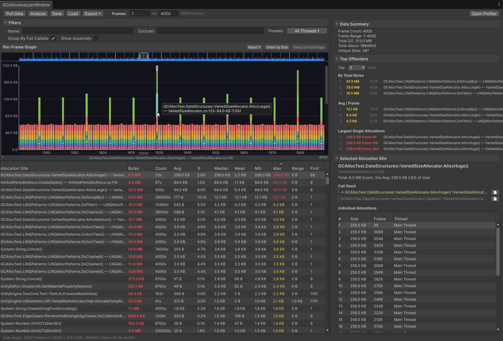
</p>

## Table of Contents

- [Features](#features)
  - [Analyzer Window](#analyzer-window)
    - [Filtering](#filtering)
    - [Top Offenders](#top-offenders)
    - [Selected Allocation Site](#selected-allocation-site)
    - [Customizable Colors](#customizable-colors)
  - [Per-Frame Graph](#per-frame-graph)
    - [Graph Controls](#graph-controls)
    - [Stacked Segments](#stacked-segments)
    - [Overlay Mode](#overlay-mode)
    - [Overview Strip](#overview-strip)
    - [Order by Size](#order-by-size)
  - [Profiler Module](#profiler-module)
  - [Save, Load & Export](#save-load--export)
- [Getting Started](#getting-started)
  - [Installation](#installation)
  - [Usage](#usage)
- [Requirements](#requirements)
- [Roadmap](#roadmap)

## Features

### Analyzer Window

Open via **Window > Analysis > GC Alloc Analyzer**.

Analyze GC allocations across any range of profiled frames. Click **Pull Data** to read per-frame GC totals from the Profiler, then click **Analyze** for full call-stack extraction to see exactly where every allocation comes from.

<p align="center">
  
</p>

- **Sortable, resizable columns** — Allocation Site, Bytes, Count, Avg, %, and per-frame statistics (Median, Mean, Min, Max, Range, First). Click any column header to sort; click again to reverse.
- **Call-stack grouping** — toggle between full call stack (default) and top-level allocation method grouping
- **Color-coded severity** — allocation sizes are colored by threshold (red > 10 KB, yellow > 1 KB, gray) to highlight the worst offenders at a glance
- **Context menus** — right-click any allocation site row to copy the name, add it to the name or exclude filter, or open the source file in your IDE
- **No-callstack fallback** — when Profiler call stacks aren't enabled, automatically falls back to hierarchy path resolution so you still get useful grouping

<p align="center">
  
</p>

#### Filtering

Filter the allocation site table to focus on what matters.

<p align="center">
  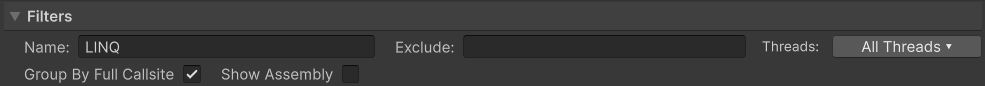
</p>

- **Name Filter** — include only allocation sites matching this text
- **Exclude Filter** — hide allocation sites matching this text
- **Threads** — multi-select dropdown to filter by specific threads, or view all. Quick-select options for Main Thread Only and Render Thread Only.
- **Group By Full Callsite** — toggle between full call stack grouping (default) and top-level allocation method grouping
- **Show Assembly** — toggle assembly prefixes on method names (e.g., `UnityEngine.Object::Instantiate` vs `Object::Instantiate`)

#### Top Offenders

<p align="center">
  
</p>

The right panel ranks the worst allocation sites in three views:

- **By Total Bytes** — top N sites by cumulative allocation across all analyzed frames, showing rank, total bytes, percentage, and method name
- **Avg / Frame** — top N sites by average bytes per frame, useful for identifying consistent per-frame allocators
- **Largest Single Allocations** — top N individual `GC.Alloc` events by size, showing the allocation size, frame number, and method name. Click an entry to select it in the individual allocations list.

The dropdown lets you choose how many entries to show (1-10, default 3).

#### Selected Allocation Site

Clicking any row in the allocation site table opens a detail panel on the right:

- **Summary stats** — total bytes, count, average, and percentage of total for the selected site
- **Call Stack** — full resolved call stack from the allocating method (highlighted in yellow) through each caller (gray), with source file and line number
- **Open in IDE** — click the page icon next to any call stack frame to open the source file in your IDE at the exact line

<p align="center">
  
</p>

- **Individual Allocations** — every `GC.Alloc` event for this site with size, frame number, and thread
- **Profiler Sync** — click any individual allocation to jump to that frame in the Profiler's CPU module, or click a marker row to sync the Profiler to the frame with the largest allocation for that site

<p align="center">
  
</p>

#### Customizable Colors

Configure allocation severity colors, byte thresholds, and graph appearance via **Preferences > Analysis > GC Alloc Analyzer**.

<p align="center">
  
</p>

**Severity Colors** — control the color coding in the marker list's Bytes column:
- **High** (default red) — allocations above the high threshold (default 10,240 B)
- **Medium** (default yellow) — allocations above the medium threshold (default 1,024 B)
- **Low/Normal** (default gray) — allocations below the medium threshold

**Graph Colors** — customize the per-frame bar chart appearance:
- **Bar Color** — primary bar fill (default blue)
- **Dim Bar Color** — unselected/dimmed bars when a selection is active
- **Overlay Highlight** — color for the method overlay band
- **Highlight Tint / Outline** — selected bar/segment highlight
- **Bar Spacing** — gap between bars (0-50%)

### Per-Frame Graph

Interactive bar chart showing GC allocations per frame.

#### Graph Controls

**Zoom & Pan**

| Input | Action |
|-------|--------|
| `Mouse Wheel` | Zoom X-axis (centered on cursor) |
| `Ctrl+Mouse Wheel` | Zoom Y-axis |
| `W` / `S` | Zoom in / out (centered on visible range) |
| `A` / `D` | Pan left / right |
| `Middle-Mouse Drag` | Pan both axes (drag to scroll) |
| `Alt+Left Drag` | Pan both axes (alternative to middle mouse) |
| `Y-Axis Drag` | Drag on Y-axis labels to zoom vertically |

| | |
|---|---|
| 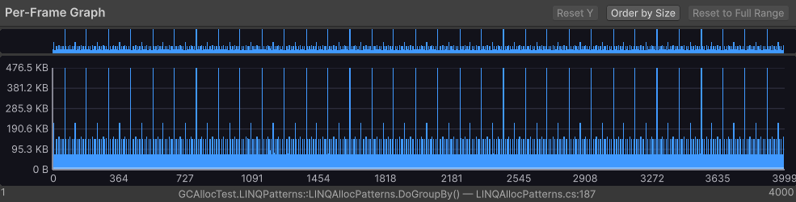 | 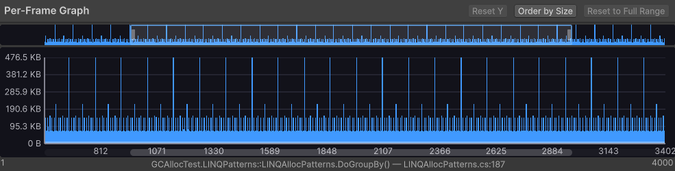 |
| Mouse wheel zoom | Ctrl+Mouse wheel Y zoom |
| 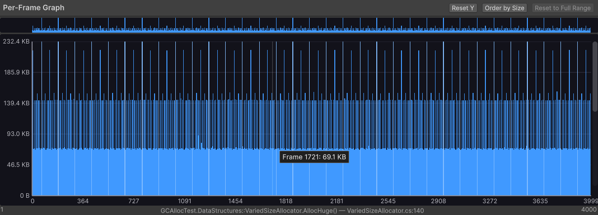 | 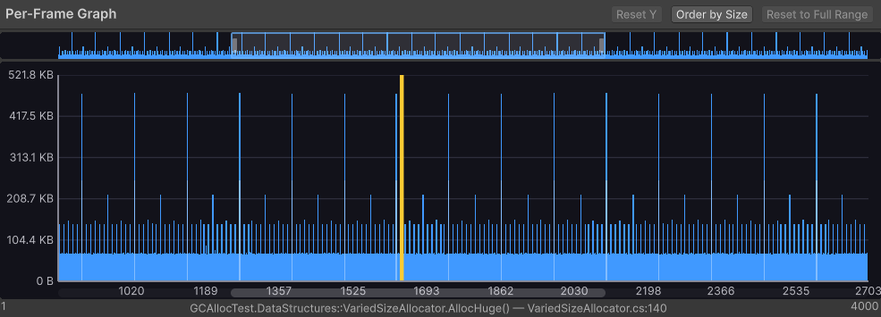 |
| Middle-mouse / Alt+Left drag pan | Y-axis label drag zoom |

**Selection & Navigation**

| Input | Action |
|-------|--------|
| `Left Click` | Select bar (navigates Profiler to that frame) |
| `Left Drag` | Select frame range (drag across bars) |
| `Ctrl+Left Click` | Additive select (add bar to existing selection) |
| `Left` / `Right` | Move to adjacent bar (selects it, syncs Profiler) |
| `Up` / `Down` | Move to adjacent segment within the current bar |

<p align="center">
  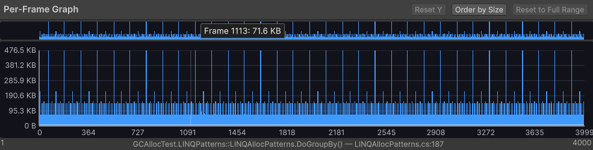<br>
  <em>Left drag to select frame range</em>
</p>

<p align="center">
  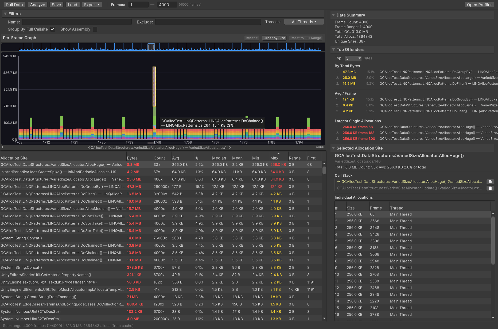<br>
  <em>Left/Right arrow key bar navigation</em>
</p>

<p align="center">
  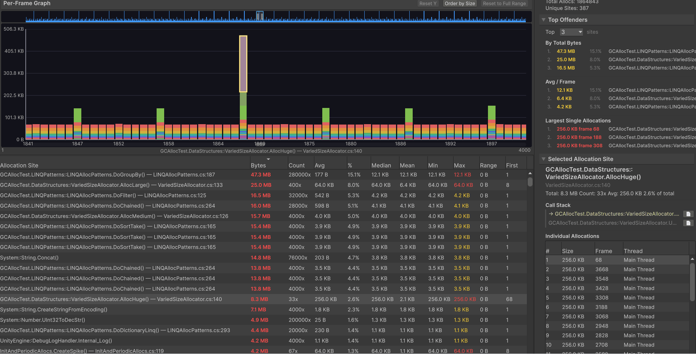<br>
  <em>Up/Down arrow key segment navigation</em>
</p>

#### Stacked Segments

<p align="center">
  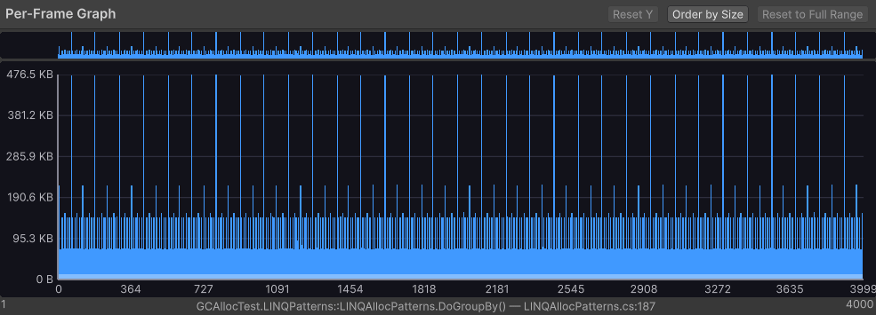
</p>

When zoomed in far enough that each bar represents a single frame, bars split into colored segments showing the top allocation methods. Each method is assigned a distinct color from a 16-color palette ranked by total bytes; methods beyond the top 16 are grouped as gray "Others". Hover over a segment to see the method name and allocation size. Click a segment to select that method in the marker list.

#### Overlay Mode

<p align="center">
  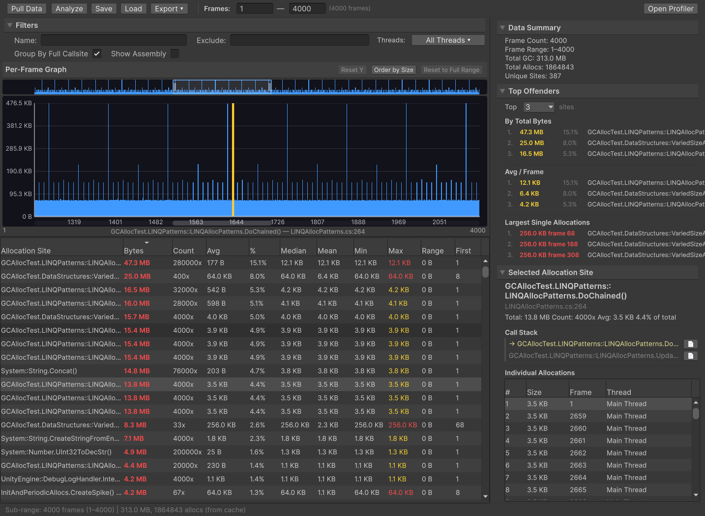
</p>

Select an allocation site in the marker table to see its per-frame contribution overlaid on the graph. The overlay band shows how much of each frame's total GC is attributable to that single method. When zoomed in to segment level, the matching segment is highlighted with a gold tint and outline.

#### Overview Strip

<p align="center">
  
</p>

A miniature full-range view that appears when zoomed in. Shows a viewport indicator of your current position. Click anywhere on the strip to jump there, drag the viewport rectangle to scroll, or drag its edges to resize (zoom).

#### Order by Size

<p align="center">
  
</p>

Toggle between chronological frame order and size-descending order to spot the largest spikes. Useful for identifying outlier frames that may otherwise be lost in a long recording.

### Profiler Module

A dedicated **GC Alloc** module inside Unity's Profiler window for per-frame analysis.

<p align="center">
  
</p>

- **Per-frame breakdown** — shows allocation sites for the currently selected Profiler frame
- **Sortable columns** — Allocation Site, Bytes, Count, and Avg with sort indicators
- **Expandable call stacks** — click the arrow to expand the full call stack inline, with the allocating method highlighted in yellow
- **LRU cache** — results for up to 512 frames are cached so scrubbing back and forth is instant
- **Open GC Alloc Analyzer** — button to jump straight to the multi-frame Analyzer window

### Save, Load & Export

- **Save/Load snapshots** — save analysis results as `.gcas` binary snapshots for sharing or later review. Load snapshots without needing the original Profiler data. Snapshot files use a two-part format: a lightweight skeleton (markers, groups, stats) for instant UI restore, and a heavy payload (individual allocations) for full interactivity.
- **Export Marker Table CSV** — export the filtered allocation site table with all statistics (Bytes, Count, Avg, %, Median, Mean, Min, Max, Range, First)
- **Export Individual Allocations CSV** — export every raw `GC.Alloc` event with size, frame, thread, and full call stack
- **Open Compare Tool** — launch a standalone HTML comparison tool to diff two exported CSV files side-by-side
<p align="center">
  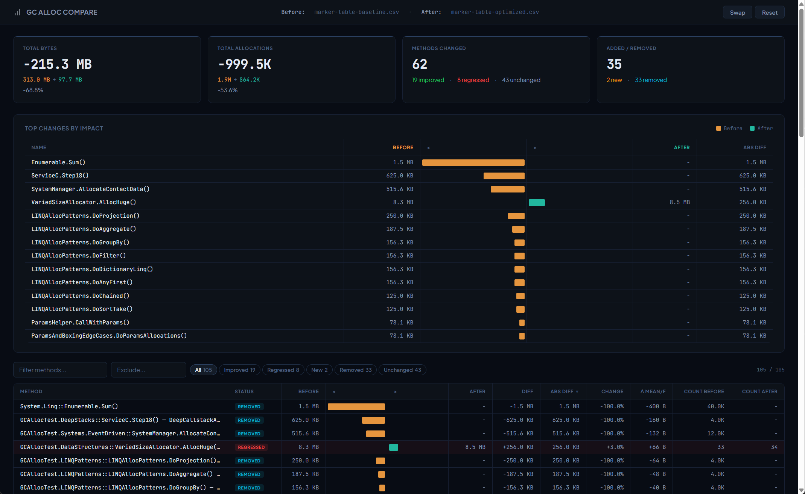
</p>


---

## Getting Started

### Installation

**Via Git URL (recommended)** — In Unity's Package Manager, click **+** > **Add package from git URL** and enter:

```
https://github.com/EricJRico/GCAllocAnalyzer.git
```

**Local development** — Clone the repo and reference it from a separate Unity project's `Packages/manifest.json`:

```json
{
  "dependencies": {
    "com.ericjrico.gcalloc-analyzer": "file:../GCAllocAnalyzer"
  }
}
```

### Usage

1. **Record profiler data** — Enter Play Mode and let your scene run. Open the Profiler (`Ctrl+7`) and enable **Call Stacks > GC.Alloc** in the Profiler toolbar for detailed call-stack resolution.
2. **Open the analyzer** — Go to **Window > Analysis > GC Alloc Analyzer**.
3. **Pull Data** — Click **Pull Data** to read per-frame GC totals from the Profiler. This populates the per-frame graph.
4. **Analyze** — Set your frame range and click **Analyze** for full call-stack extraction.
5. **Explore** — Sort, filter, and click allocation sites to see call stacks, per-frame overlays, and individual allocations. Drag-select on the graph to analyze sub-ranges instantly from cache.

> **Tip:** For the best results, enable **Call Stacks > GC.Alloc** in the Profiler toolbar *before* entering Play Mode. Without call stacks, you'll see hierarchy paths instead of resolved method names.

---

## Requirements

- **Unity 6000.0+**
- **Profiler data** — requires an active or loaded Profiler session
- **Call stacks** — enable **Call Stacks > GC.Alloc** in the Profiler toolbar for full call-stack resolution (otherwise falls back to hierarchy paths)

## Roadmap

- **Compare mode** — side-by-side analysis of two profiling sessions with delta columns and paired per-frame graphs
- **Persistent thread filter dropdown** — multi-select panel that stays open instead of closing after each click
- **Progress indicators** — visual feedback during save/load/export operations
- **Performance optimizations** — faster grouping and extraction for large datasets (500K+ allocations)

See [CHANGELOG](CHANGELOG.md) for release history.

## Technical Documentation

- [Package Architecture](Documentation~/architecture/gcalloc-analyzer-architecture.md) — comprehensive architecture reference covering data model, analysis pipeline, rendering engine, domain reload, serialization format, and all subsystems
- [Domain Reload System](Documentation~/architecture/domain-reload-system.md) — how analysis state survives Unity's domain reload using two-phase binary serialization

---

## License

[MIT](LICENSE) — Copyright (c) 2025-2026 Eric J Rico
