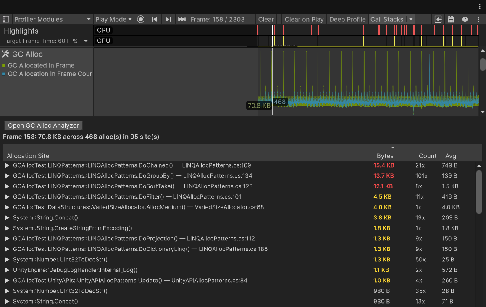
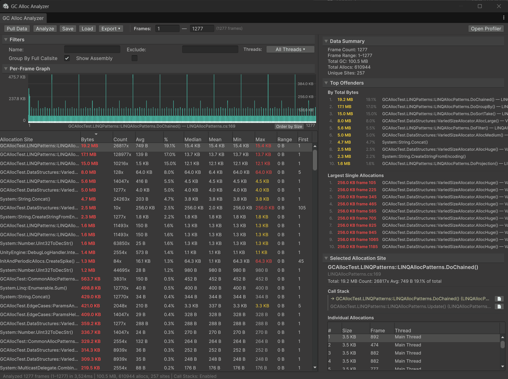
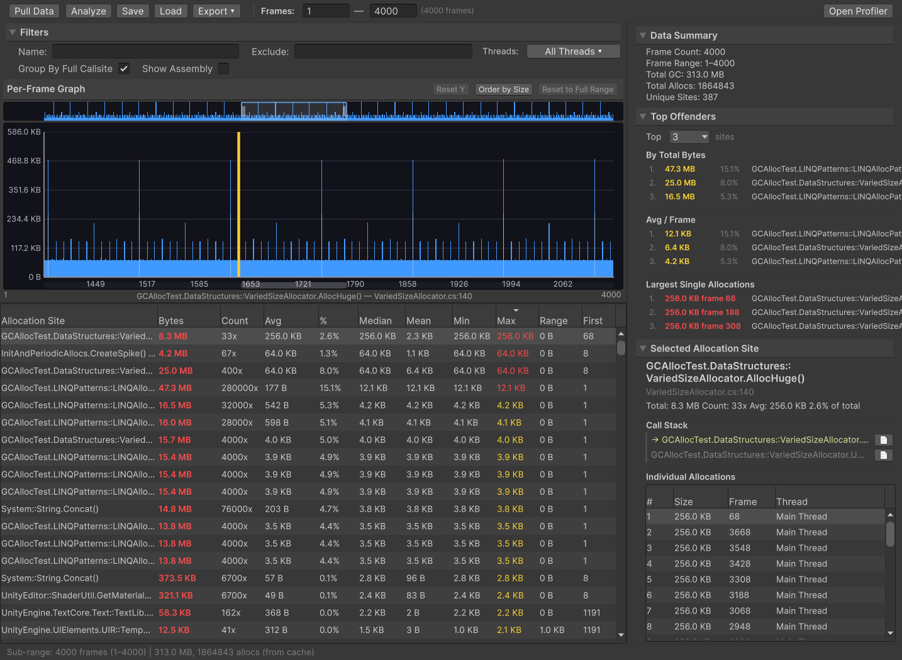
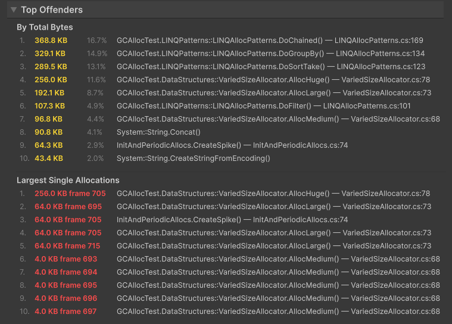
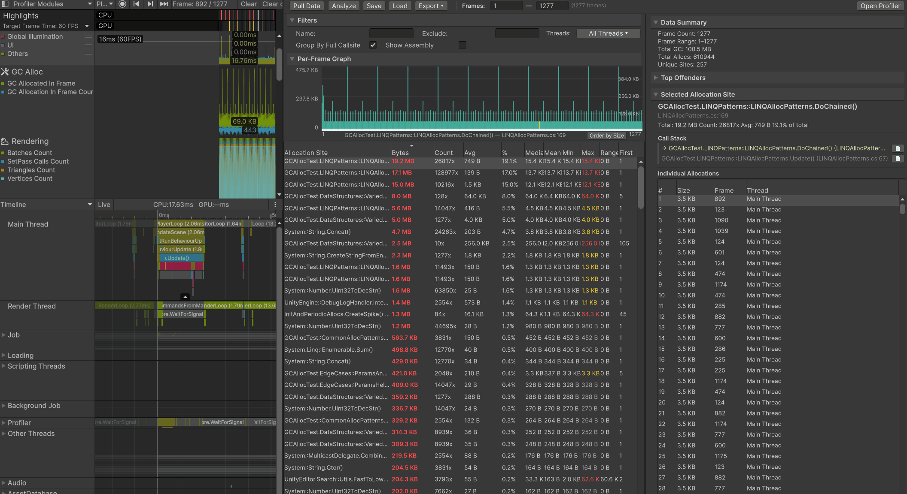
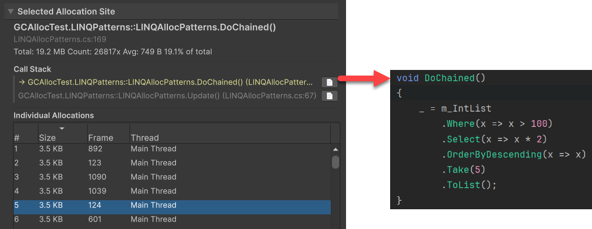
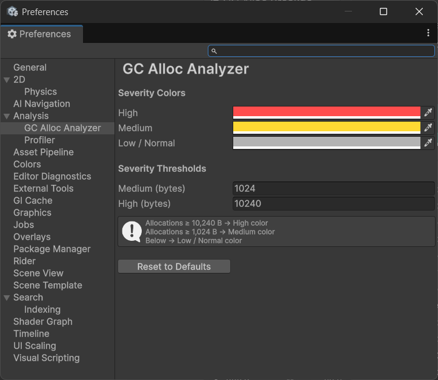
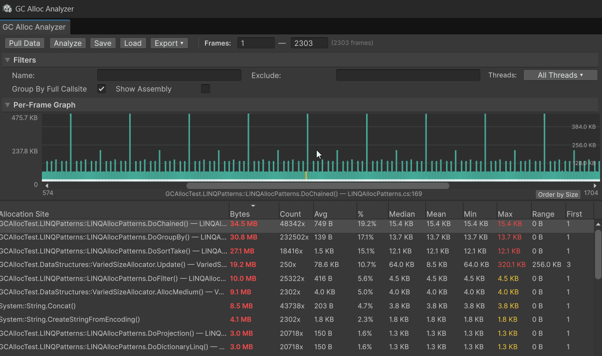
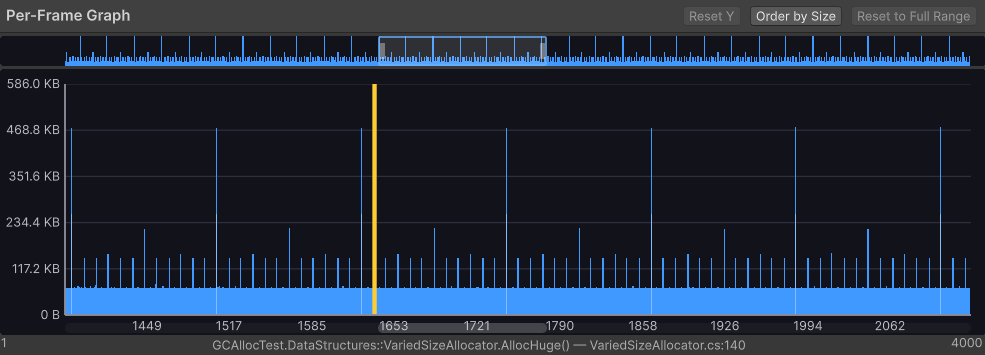
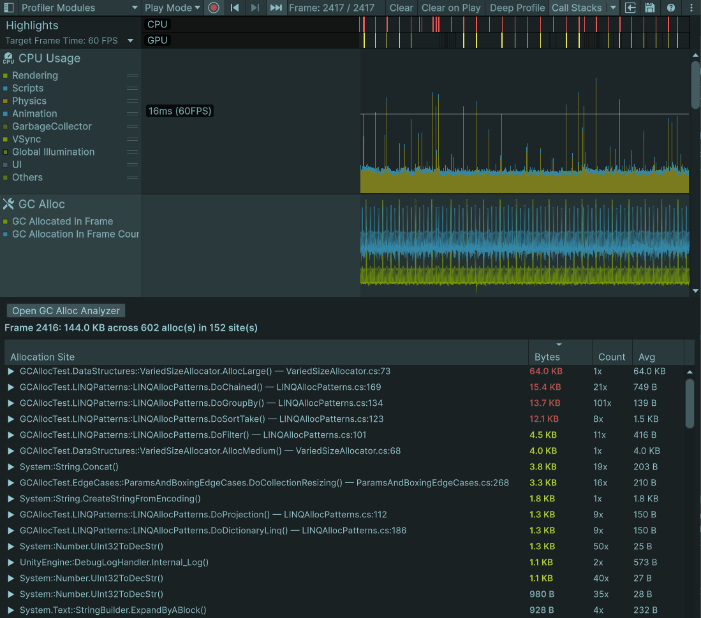

# GC Alloc Analyzer

[](https://unity.com/)
[](LICENSE)
[](https://github.com/EricJRico/GCAllocAnalyzer/actions/workflows/github-code-scanning/codeql)

A Unity Editor tool for profiling and analyzing garbage collection allocations. Integrates with Unity's Profiler as both a Profiler Module (per-frame breakdown) and a standalone Editor Window (multi-frame analysis).

## GC Alloc Module
<p align="center">
  
</p>

## GC Alloc Analyzer

<p align="center">
  
</p>

## Table of Contents

- [Features](#features)
  - [Analyzer Window](#analyzer-window)
    - [Filtering](#filtering)
    - [Top Offenders](#top-offenders)
    - [Selected Allocation Site](#selected-allocation-site)
    - [Customizable Severity Colors](#customizable-severity-colors)
  - [Per-Frame Graph](#per-frame-graph)
    - [Zoom & Pan](#zoom--pan)
    - [Y-Axis Zoom](#y-axis-zoom)
    - [Drag Select](#drag-select)
    - [Stacked Segments](#stacked-segments)
    - [Overlay Mode](#overlay-mode)
    - [Overview Strip](#overview-strip)
    - [Order by Size](#order-by-size)
  - [Profiler Module](#profiler-module)
  - [Save, Load & Export](#save-load--export)
- [Getting Started](#getting-started)
  - [Installation](#installation)
  - [Usage](#usage)
- [Keyboard Shortcuts](#keyboard-shortcuts)
- [Requirements](#requirements)
- [Roadmap](#roadmap)

## Features

### Analyzer Window

Open via **Window > Analysis > GC Alloc Analyzer**.

Analyze GC allocations across any range of profiled frames. Click **Pull Data** to read per-frame GC totals from the Profiler, then click **Analyze** for full call-stack extraction to see exactly where every allocation comes from.

<p align="center">
  
</p>

- **Sortable, resizable columns** — Allocation Site, Bytes, Count, Avg, %, and per-frame statistics (Median, Mean, Min, Max, Range, First). Click any column header to sort; click again to reverse.
- **Call-stack grouping** — toggle between full call stack (default) and top-level allocation method grouping
- **Color-coded severity** — allocation sizes are colored by threshold (red, yellow, gray) to highlight the worst offenders at a glance
- **Context menus** — right-click any allocation site row to copy the name, add it to the name or exclude filter, or open the source file in your IDE

#### Filtering

Filter the allocation site table to focus on what matters.

<!-- TODO: Add screenshot showing filter area -->

- **Name Filter** — include only allocation sites matching this text
- **Exclude Filter** — hide allocation sites matching this text
- **Threads** — multi-select dropdown to filter by specific threads, or view all
- **Show Assembly** — toggle assembly prefixes on method names (e.g., `UnityEngine.Object::Instantiate` vs `Object::Instantiate`)

#### Top Offenders

<p align="center">
  
</p>

The right panel ranks the worst allocation sites in two views:

- **By Total Bytes** — top 10 sites by cumulative allocation across all analyzed frames, showing rank, total bytes, percentage, and method name
- **Largest Single Allocations** — top 10 individual `GC.Alloc` events by size, showing the allocation size, frame number, and method name. Click an entry to select it in the individual allocations list.

#### Selected Allocation Site

<p align="center">
  
</p>

Clicking any row in the allocation site table opens a detail panel on the right:

- **Summary stats** — total bytes, count, average, and percentage of total for the selected site
- **Call Stack** — full resolved call stack from the allocating method (highlighted in yellow) through each caller (gray), with source file and line number
- **Open in IDE** — click the page icon next to any call stack frame to open the source file in your IDE at the exact line

<p align="center">
  
</p>

- **Individual Allocations** — every `GC.Alloc` event for this site with size, frame number, and thread. Right-click any row to jump to that frame in the Profiler.

#### Customizable Severity Colors

Configure allocation severity colors and byte thresholds via **Preferences > Analysis > GC Alloc Analyzer**.

<p align="center">
  
</p>

- **Severity Colors** — customize High (default red), Medium (default yellow), and Low/Normal (default gray)
- **Severity Thresholds** — set the byte boundaries for Medium (default 1,024 B) and High (default 10,240 B)

### Per-Frame Graph

Interactive bar chart showing GC allocations per frame.

#### Zoom & Pan

<p align="center">
  
</p>

Mouse wheel or `W`/`S` to zoom in and out, anchored at the cursor position. `A`/`D` keys to pan left and right through frames.

#### Y-Axis Zoom

<!-- TODO: Add gif showing Y-axis zoom -->

Zoom the Y-axis to focus on smaller allocations without losing large spikes off-screen. `Ctrl+Mouse Wheel` to zoom vertically, or drag directly on the Y-axis labels. Click **Reset Y** to restore auto-fit.

#### Drag Select

<p align="center">
  
</p>

Drag across bars to select a sub-range and instantly re-analyze from cache — no re-extraction needed. Click **Reset to Full Range** to restore the original analysis.

#### Stacked Segments

<!-- TODO: Add gif showing stacked segments at full zoom -->

When zoomed in far enough that each bar represents a single frame, bars split into colored segments showing the top allocation methods. Click a segment to select that method in the marker list.

#### Overlay Mode

<!-- TODO: Add gif showing overlay mode -->

Select an allocation site in the marker table to see its per-frame contribution overlaid on the graph in a separate color. Instantly visualize how a single allocation site contributes across your frame range.

#### Overview Strip

<!-- TODO: Add gif showing overview strip interaction -->

A miniature full-range view that appears when zoomed in. Shows a viewport indicator of your current position. Click anywhere on the strip to jump there, or drag the viewport rectangle to scroll.

#### Order by Size

<p align="center">
  
</p>

Toggle between chronological frame order and size-descending order to spot the largest spikes. Useful for identifying outlier frames that may otherwise be lost in a long recording.

### Profiler Module

A dedicated **GC Alloc** module inside Unity's Profiler window for per-frame analysis.

<p align="center">
  
</p>

- **Per-frame breakdown** — shows allocation sites for the currently selected Profiler frame
- **Sortable columns** — Allocation Site, Bytes, Count, and Avg with sort indicators
- **Expandable call stacks** — click the arrow to expand the full call stack inline, with the allocating method highlighted in yellow
- **LRU cache** — results for up to 512 frames are cached so scrubbing back and forth is instant
- **Open GC Alloc Analyzer** — button to jump straight to the multi-frame Analyzer window

### Save, Load & Export

<!-- TODO: Add screenshot showing toolbar with Save/Load/Export buttons -->

- **Save/Load snapshots** — save analysis results as `.json` for sharing or later review. Load snapshots without needing the original Profiler data.
- **Export Marker Table CSV** — export the filtered allocation site table with all statistics (Bytes, Count, Avg, %, Median, Mean, Min, Max, Range, First)
- **Export Individual Allocations CSV** — export every raw `GC.Alloc` event with size, frame, thread, and full call stack

---

## Getting Started

### Installation

**Via Git URL (recommended)** — In Unity's Package Manager, click **+** > **Add package from git URL** and enter:

```
https://github.com/EricJRico/GCAllocAnalyzer.git
```

**Local development** — Clone the repo and reference it from a separate Unity project's `Packages/manifest.json`:

```json
{
  "dependencies": {
    "com.ericjrico.gcalloc-analyzer": "file:../GCAllocAnalyzer"
  }
}
```

### Usage

1. **Record profiler data** — Enter Play Mode and let your scene run. Open the Profiler (`Ctrl+7`) and enable **Call Stacks > GC.Alloc** in the Profiler toolbar for detailed call-stack resolution.
2. **Open the analyzer** — Go to **Window > Analysis > GC Alloc Analyzer**.
3. **Pull Data** — Click **Pull Data** to read per-frame GC totals from the Profiler. This populates the per-frame graph.
4. **Analyze** — Set your frame range and click **Analyze** for full call-stack extraction.
5. **Explore** — Sort, filter, and click allocation sites to see call stacks, per-frame overlays, and individual allocations. Drag-select on the graph to analyze sub-ranges instantly.

> **Tip:** For the best results, enable **Call Stacks > GC.Alloc** in the Profiler toolbar *before* entering Play Mode. Without call stacks, you'll see hierarchy paths instead of resolved method names.

---

## Keyboard Shortcuts

Graph shortcuts are active when the graph is focused (automatic on hover).

| Input | Action |
|-------|--------|
| `Mouse Wheel` | Zoom in / out (centered on cursor) |
| `Ctrl+Mouse Wheel` | Zoom Y-axis in / out |
| `W` / `S` | Zoom in / out (centered on cursor) |
| `A` / `D` | Pan left / right |
| `Middle-Mouse Drag` | Pan both axes |
| `Left` / `Right` | Navigate one bar at a time |
| `Shift+Left` / `Shift+Right` | Navigate 10 bars at a time |
| `Y-Axis Drag` | Drag down to zoom Y in, up to zoom out |

---

## Requirements

- **Unity 6000.0+**
- **Profiler data** — requires an active or loaded Profiler session
- **Call stacks** — enable **Call Stacks > GC.Alloc** in the Profiler toolbar for full call-stack resolution (otherwise falls back to hierarchy paths)

## Roadmap

- **Compare mode** — side-by-side analysis of two profiling sessions with delta columns and paired per-frame graphs
- **Persistent thread filter dropdown** — multi-select panel that stays open instead of closing after each click
- **Progress indicators** — visual feedback during save/load/export operations
- **Performance optimizations** — faster grouping and extraction for large datasets (500K+ allocations)

See [CHANGELOG](CHANGELOG.md) for release history.

## Technical Documentation

- [Domain Reload System](Documentation~/domain-reload-system.md) — how analysis state survives Unity's domain reload using two-phase binary serialization

---

## License

[MIT](LICENSE) — Copyright (c) 2025-2026 Eric J Rico
